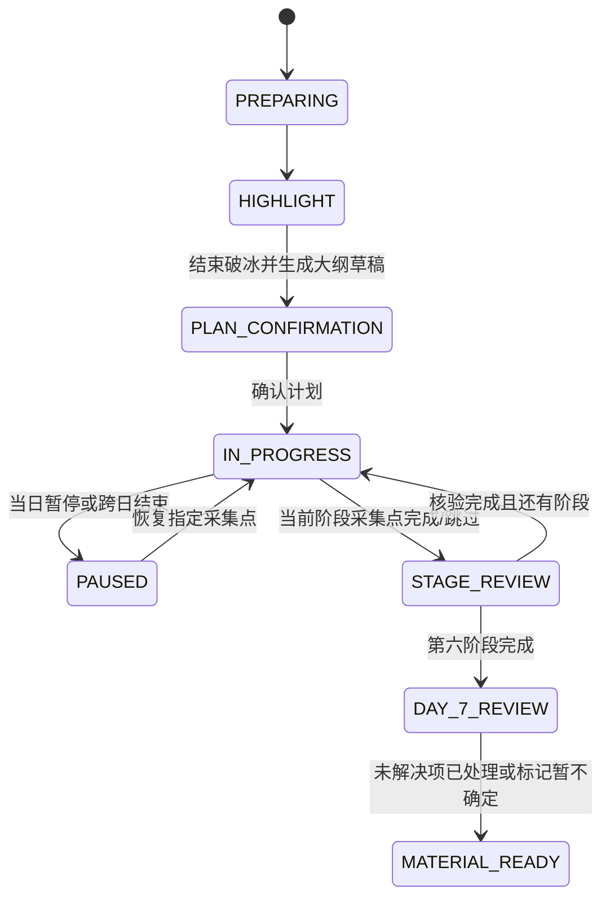
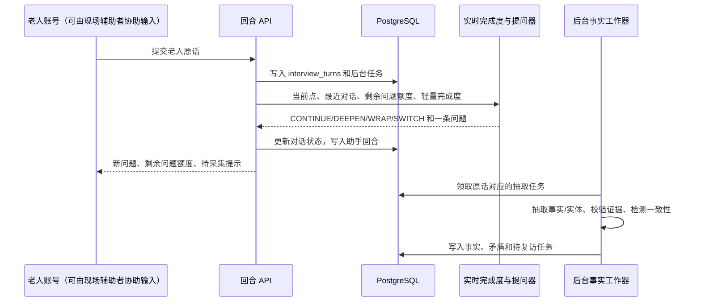

# 7 天线下协同传记采访开发落地设计

## 1. 目标和边界

本设计落实 [7天线下协同传记采访实现方案.md](7天线下协同传记采访实现方案.md)。每位老人拥有自己的账号和采访资料；线下辅助者只在现场陪同、协助输入和操作当前老人账号，不在系统中拥有账号、权限、工作台或审计身份。系统负责采访路线、问题额度控制、材料抽取、情绪承接、阶段核验和跨日恢复。

首版只支持中文文字录入，不实现录音、图片、家属协作、外部真实性核查和传记成稿生成。采访完成后，通过版本化素材包 API 向传记生成系统交付已采集材料。

当前项目的 `biographies`、`outline_versions`、`collection_points`、`material_fragments` 和 Redis 会话属于旧链路。本方案新增独立领域表和 API，不迁移旧数据；前端切换后旧采访入口返回 `410 Gone`，防止两条状态机同时写入。

## 2. 功能点拆分

| 编号 | 功能点 | 用户价值 | 依赖 |
| --- | --- | --- | --- |
| F01 | 老人账号与数据隔离 | 每位老人只能访问自己的采访和素材 | 无 |
| F02 | 六人生域约束与 AI 大纲生成 | 用六域保证完整性，由 AI 根据高光生成完整采访大纲 | 无 |
| F03 | 采访创建与 7 天日程 | 可安排、暂停和跨日恢复采访 | F01、F02 |
| F04 | 高光破冰 | 低压力建立对话，并提供个性化线索 | F03 |
| F05 | AI 大纲编辑和计划确认 | 高光后生成完整六阶段大纲，支持手动修改后生效 | F04、F02 |
| F06 | 采集点问题额度与深度控制 | 用可发问数和可追问数控制深挖与收束节奏 | F05 |
| F07 | 后台事实抽取与实体归档 | 异步将原话转化为带证据的结构化素材，不阻塞回复 | F06 |
| F08 | 跳跃叙述与待回访管理 | 跟住有价值的新故事，不丢失原采集点 | F06、F07 |
| F09 | 情绪、拒答和低信息引导 | 减少老人压力，不对敏感内容强挖 | F06、F07 |
| F10 | 阶段完成度和事实一致性核验 | 阶段结束前补全必要事实、纠正前后矛盾 | F07、F08、F09 |
| F11 | 第 7 天复核与素材包发布 | 输出可供传记系统消费的可信版本 | F10 |
| F12 | 老人采访工作台 | 将日程、录入、问题额度、线索、大纲编辑和核验集中到一个页面 | F01-F11 |

## 3. 领域蓝图和计划生成

### 3.1 六个人生域约束

数据库种子数据只保存六个人生域、日程顺序和自然语言覆盖目标；它们是 AI 生成大纲的硬约束，不是用户可见的固定阶段标题、采集点或事实字段。AI 必须为每个人生域生成一个阶段，并为每个阶段生成 2-3 个采集点。

| 阶段代码 | 必覆盖人生域 | AI 阶段必须覆盖的主题 | 材料目标 |
| --- | --- | --- | --- |
| S01 | 原生家庭与童年印记 | 成长环境、家庭日常、童年影响 | 动态材料目标，由 LLM 根据叙述追加 |
| S02 | 求学与青春成长 | 学习、同伴或师长、独立和理想形成 | 动态材料目标，由 LLM 根据叙述追加 |
| S03 | 走入社会与职业起步 | 工作、谋生、技能和选择 | 动态材料目标，由 LLM 根据叙述追加 |
| S04 | 关系、家庭与责任 | 重要关系、支持、照料和取舍 | 动态材料目标，由 LLM 根据叙述追加 |
| S05 | 人生转折与贡献 | 成就、困难、转折和贡献 | 动态材料目标，由 LLM 根据叙述追加 |
| S06 | 当下生活与人生回望 | 当前生活、珍视的人事和人生体会 | 动态材料目标，由 LLM 根据叙述追加 |

每个 AI 生成的采集点必须包含 `title`、`purpose`、`opening_intent`、`low_pressure_intent`、`collection_goals`、`completion_rule`、`sensitive_boundary` 和 `highlight_evidence`。两类 `intent` 是供实时 LLM 生成当轮问句的自然语言上下文，不是可以由前端直接照读的固定话术。`collection_goals` 是自然语言材料目标，不是固定事实字段。服务端在确认前只校验六个阶段代码全部出现且不重复、每阶段点数为 2-3、目标非空、引用的高光证据来自已保存原话。

### 3.2 高光破冰到完整 AI 大纲

1. 创建采访后进入 `HIGHLIGHT`，LLM 根据破冰目标生成开场问题。
2. 老人账号会话连续录入回答；现场辅助者可代为输入，但系统只记录老人账号下的原话。每轮照常持久化、抽取事实和实体，不创建正式阶段采集点。
3. 高光破冰分配 1 个开场问题和最多 3 个追问。核心信息已足够或额度用尽时，系统返回收束动作；在当前老人账号会话中结束破冰。
4. `OutlineGenerationService` 将高光阶段的已验证材料摘要、实体摘要和原文证据交给 LLM，返回严格 JSON 的六阶段完整大纲草稿。
5. 服务端验证大纲的域映射、阶段数量、采集点数量、自然语言材料目标和证据引用；不合格结果重试一次，仍失败则保留破冰材料并标记 `PLAN_CONFIRMATION`，不自动开始采访。
6. 在大纲编辑页手动修改阶段标题、顺序、采集点、开场/低压力提问意图和材料目标。确认时将编辑后的草稿冻结为不可变 `interview_plan_versions`；采访只能读取已确认版本。

AI 生成的是完整大纲草稿，不直接发布计划。手动修改后的值以当前老人账号会话提交的内容为准，并保留 AI 原始草稿和高光证据以便回溯。

## 4. 业务状态和模块交互

### 4.1 总状态机



采集点有两套独立状态。对话状态为 `NOT_STARTED`、`ACTIVE`、`SOFT_COMPLETE`、`PAUSED`、`SKIPPED`，由实时回复链路维护；材料状态为 `PENDING_EXTRACTION`、`VERIFIED_COMPLETE`、`NEEDS_REVISIT`、`NEEDS_REVIEW`，由后台工作器维护。`SKIPPED` 必须保存 `skip_reason`；`PAUSED` 保留当前问题、已问次数、剩余可发问数和待回访线索。所有点的对话状态收束后才能进入 `STAGE_REVIEW`；阶段复核页等待该阶段后台任务完成、失败或标为待人工复核后再展示材料缺口和矛盾。

### 4.2 单回合处理顺序



`POST /turns` 的回复路径只调用 `DialogueProgressService`：它只输出 LLM 判断的材料覆盖摘要、待采集目标、当前深挖预算、下一动作和一个问题，不返回或持久化具体材料值。材料抽取、实体归档、证据校验和一致性检测由工作器异步执行，任何后台结果都不能阻塞、插入或改写已经发出的回复。

处理必须在同一业务事务中保证“原话和后台任务已保存”。后台 LLM 调用失败时，原话仍保留，任务进入重试或 `NEEDS_REVIEW`；实时路由或问句生成失败时置 `REPLY_PENDING` 并允许重新生成，不返回任何固定采访文案。

### 4.3 跳跃叙述规则

实时路由器完全使用 LLM 对当前原话、阶段目标和对话上下文的语义判断；它不等待后台材料抽取结果，也不使用关键词、正则或字符长度规则：

- **完整新故事**：LLM 将原话标记为 `bounded_story` 并给出目标人生域。服务端只校验当前状态和临时追问额度，随后暂停原采集点、建立 `follow_up_threads`，最多追问两次并恢复原点或安排下次恢复。
- **同阶段跳跃**：新故事映射到当前阶段的另一个计划采集点时，只更新该点的实时完成度和待回访线索，不修改采集点的固定顺序；具体事实仍由后台工作器归档。
- **跨阶段跳跃**：映射到其他阶段时，保存为待回访线索；若故事本身完整则临时跟随，若仅为提及则不切换，只在目标阶段开始时优先提示。
- **未计划片段**：LLM 无法映射到六个人生域时保存为 `UNPLANNED_FRAGMENT`。阶段结束时由 LLM 基于材料价值建议是否转成 `NEEDS_REVIEW` 补点；服务端只阻止模型自动改写已确认计划。

### 4.4 采集点深度、收束和切换

每个计划采集点只配置自然语言 `collection_goals` 和 `completion_rule`，不配置事件、人物、时间等固定信息维度。`DialogueProgressService` 把这些目标、完整对话、上轮自然语言覆盖摘要、候选待回访线索和剩余问题额度交给 LLM。LLM 自行判断当前已谈到的材料、仍值得追问的缺口、是否应收束或切换，并生成唯一的下一句用户可见内容；它不写入材料账本。

单点默认预算为 1 个开场问题、最多 2 个核心缺口追问、最多 1 个叙事价值追问和 1 个收束动作；老人回答丰富时，LLM 可以主动放弃剩余额度。每次调用模型都传入 `remaining_question_count`、`remaining_core_follow_up_count` 和 `remaining_narrative_follow_up_count`，并且结构化输出不得选择余额为 0 的问题动作。

| LLM 返回动作 | 服务端允许条件 | 服务端行为 |
| --- | --- | --- |
| `CONTINUE` / `DEEPEN` | 当前点可提问，且总额度与对应追问额度均大于 0 | 保存 LLM 生成的问题并原子扣减额度 |
| `WRAP` | 当前点处于可收束状态 | 保存 LLM 生成的收束语，不把它计入问题额度 |
| `SWITCH` | LLM 选择的目标点属于该采访且允许进入 | 保存 LLM 生成的收束语，暂停或完成原点，激活目标点 |
| `PAUSE` / `SKIP` | 当前状态允许暂停或跳过 | 持久化原因与状态；是否换题及问句仍由 LLM 返回 |

LLM 在所有可选目标中决定下一点，包括当前点待补材料、当前阶段待回访线索、下一个计划采集点和跨阶段线索；后端不把它们按固定优先级路由，只验证候选确属当前采访、计划版本未被冻结外改写且状态允许。若后台在当前点收束后发现材料缺口，只创建候选待复访任务，等待下一轮 LLM 选题，不能插入正在进行的回复。

### 4.5 情绪与低意愿规则

| 信号 | 系统动作 | 禁止行为 |
| --- | --- | --- |
| 不知道、想不起来、没什么 | 一句低压力承接，切到当前阶段最容易的未完成采集点 | 重复追问同一细节 |
| 不想说、跳过、别问了 | 标记当前点 `SKIPPED` 或 `PAUSED`，记录原因，切到低压力点 | 追问拒答原因 |
| 明显悲伤、焦虑、创伤 | 一句共情，标记敏感，切换安全话题 | 心理诊断、治疗建议、追问痛苦细节 |
| 该点问题额度已用尽 | 收束当前点并切到下一优先级任务 | 为补全细节继续追加问题 |

所有用户可见话术每次最多一个问题。情绪分类仅用于采访节奏，不能作为人物事实或对外素材内容。

### 4.6 阶段末一致性核验

`ConsistencyReviewService` 在阶段的所有采集点完成或跳过后运行：

1. 将动态材料账本、原始补丁、实体提及和原话证据整体交给后台 LLM；不按时间、地点、人物等固定字段分组。
2. LLM 只有在两条或更多带不同证据的材料难以同时成立时，才能返回 `ConsistencyReviewResult`，其中每条引用必须包含材料 ID、补丁 ID、原话回合 ID 和证据摘录。模糊表述、不同叙述角度和低置信度材料不直接视为矛盾。
3. LLM 生成中性确认问题；问题和判断均不能由固定模板、关键词或正则产生。服务端只验证引用归属和证据，不裁定真假。
4. 老人回答后，先追加其回答产生的新材料，再由后台 LLM 生成 `CONFIRM`、`CORRECT`、`KEEP_BOTH` 或 `UNSURE` 解析记录。解析记录引用材料而不修改材料账本。
5. 未解决问题进入第 7 天；第 7 天结束时允许以 `UNSURE` 发布到素材包，并携带原材料及其未确定状态。

阶段复核不是普通对话回复链路的一部分。进入 `STAGE_REVIEW` 后，系统先轮询或订阅该阶段的 `field_background_jobs`；工作器完成抽取和一致性任务后再生成核验问题。超时或连续失败的任务显示“待人工复核”，但不丢失原话或阻塞后续阶段安排。

## 5. 后端实现和接口

### 5.1 服务边界

| 服务 | 职责 |
| --- | --- |
| `AuthService` | 老人账号、密码哈希、服务端会话 Cookie、所有权校验 |
| `BlueprintService` | 初始化并读取六个人生域约束 |
| `InterviewService` | 创建采访、安排 7 天日程、恢复当前状态、更新状态机 |
| `HighlightService` | 破冰开场、破冰回合和结束判断 |
| `OutlineGenerationService` | 根据高光事实生成并校验完整六阶段大纲草稿 |
| `PlanService` | 保存手动编辑、确认完整大纲、创建不可变计划版本和阶段实例 |
| `TurnService` | 原话和后台任务落库，调用实时完成度服务，写入助手回合 |
| `DialogueProgressService` | 调用实时 LLM 判断材料覆盖、深挖预算、收束、选题和下一问，不抽取材料 |
| `FactExtractionService` | 后台 LLM 增量抽取、证据校验、实体标准化和材料状态更新 |
| `BackgroundJobService` | 持久化领取、重试材料抽取和一致性检查任务 |
| `RouteService` | 正常追问、跳跃、低信息、拒答、情绪、深度预算和问题额度路由 |
| `ConsistencyReviewService` | 阶段末冲突检测、核验问题和解决记录 |
| `MaterialPackageService` | 生成不可变素材快照并暴露给传记生成系统 |

实时 LLM 适配器只返回 Pydantic 校验过的 `DialogueProgressResult` 和 `QuestionDecision`，其中不得出现材料值、实体值或原话证据。后台 LLM 适配器返回 `IncrementalExtractionPatch`、`ConsistencyReviewResult` 和 `ConsistencyResolutionResult`；每个新增材料候选必须含 `evidence_quote`，服务端使用原话连续子串校验该证据，校验失败的候选不得追加到材料账本。

### 5.2 API 契约

| 方法 | 路径 | 用途 |
| --- | --- | --- |
| `POST` | `/api/v1/auth/login` | 老人账号登录，设置 HttpOnly 会话 Cookie |
| `POST` | `/api/v1/auth/logout` | 注销当前会话 |
| `GET` | `/api/v1/interviews` | 列出当前老人账号的采访和当天任务 |
| `POST` | `/api/v1/interviews` | 创建采访，生成 7 天日程并返回 LLM 生成的高光开场问句 |
| `GET` | `/api/v1/interviews/{id}` | 读取采访全景、当前点、剩余问题额度和状态 |
| `POST` | `/api/v1/interviews/{id}/turns` | 提交老人原话，返回助手话术、采集点完成度和下一动作；不等待后台事实结果 |
| `POST` | `/api/v1/interviews/{id}/highlight/finish` | 结束破冰并生成完整 AI 大纲草稿 |
| `GET` | `/api/v1/interviews/{id}/outline/draft` | 读取待编辑的 AI 大纲草稿 |
| `PUT` | `/api/v1/interviews/{id}/outline` | 保存手动修改后的大纲并确认采访计划版本 |
| `POST` | `/api/v1/interviews/{id}/points/{point_id}/pause` | 暂停当前点并保存恢复上下文 |
| `POST` | `/api/v1/interviews/{id}/points/{point_id}/skip` | 标记跳过并记录原因 |
| `GET` | `/api/v1/interviews/{id}/stage-review` | 读取当前阶段缺口和矛盾问题 |
| `POST` | `/api/v1/interviews/{id}/consistency-issues/{issue_id}/answers` | 录入老人对核验问题的原话；后台 LLM 生成确认、纠正、并列保留或暂不确定的解析记录 |
| `POST` | `/api/v1/interviews/{id}/material-packages` | 第 7 天复核后创建素材包版本 |
| `GET` | `/api/v1/interviews/{id}/material-packages/{version}` | 供传记系统读取已发布素材包 |

除登录接口外，所有接口从 Cookie 取得 `elder_id`，并在查询条件中同时过滤 `interview_id` 和 `owner_elder_id`。资源不存在和无权访问统一返回 `404`，避免泄漏采访 ID 是否存在。现场辅助者不对应任何接口身份。

### 5.3 前端工作台

Vue 前端替换现有大纲页和旧聊天页，拆为以下界面：

- `LoginView`：老人账号登录。
- `InterviewHomeView`：当前老人账号的采访、当天任务和恢复入口。
- `HighlightView`：高光对话、已使用/剩余问题额度、结束破冰。
- `OutlineEditorView`：展示 AI 生成的完整六阶段大纲；支持在确认前编辑阶段、采集点、提问意图和材料目标。
- `InterviewWorkbenchView`：左侧显示 7 天进度和阶段/点状态；中间显示对话及原话录入；右侧显示已使用/剩余问题额度、实时待采集材料目标、最近完成的后台材料补丁、敏感标记、待回访线索和当前系统提示。材料面板异步刷新，不影响对话回复。
- `StageReviewView`：逐条展示阶段缺口与矛盾核验问题。
- `MaterialPackageView`：展示发布版本、包含事实数、未确定项和获取 API 的版本号。

前端在大纲确认前支持完整手动编辑；采访开始后只显示系统计算的提示和状态，不提供手工选择下一问题或手工篡改原话的入口。原话如需更正，新增一条更正回合并保留原回合的审计记录。

### 5.4 功能点技术实现方案

本项目沿用当前的 FastAPI、SQLAlchemy、PostgreSQL、Redis、Vue 3 和 DashScope OpenAI 兼容接口。正式采访状态不使用 LangGraph checkpoint：状态由 PostgreSQL 表、`TransitionService` 和数据库事务管理；LLM 仅作为受限的结构化决策器和后台抽取器。

#### F01 老人账号与数据隔离

- 使用 FastAPI 路由依赖 `get_current_elder()` 读取 HttpOnly、`Secure`、`SameSite=Lax` Cookie 中的随机会话令牌；服务端哈希令牌后查询 `field_login_sessions`，获取 `elder_id`。
- 密码使用 `argon2-cffi` 生成哈希，账号初始化通过 Alembic 种子迁移或受控注册脚本完成；不在配置文件、日志或 Cookie 中保存明文密码。
- 所有采访仓储方法统一接收 `elder_id`，查询条件必须包含 `field_interviews.owner_elder_id == elder_id`。更新、暂停、发布等操作也在同一条件下执行，未命中统一返回 `404`。
- 登录成功、注销、过期和密码校验失败均写审计日志，但不记录密码和采访原话。

#### F02 六人生域约束与 AI 大纲生成

- 通过 Alembic 向 `field_stage_blueprints` 写入 S01-S06 六条种子数据，内容仅包括人生域约束、自然语言覆盖目标和建议日程，不包含固定的采集点文案或事实类型。
- `OutlineGenerationService` 使用 `interview_llm.chat_json()` 调用独立提示词 `prompts/field_interview/outline-generation.md`。输入仅包含：六人生域约束、高光阶段中已完成后台证据校验的材料摘要、实体摘要和原话证据编号。
- 模型必须返回 `OutlineDraft` Pydantic 模型：`stages[6]`，每项含 `canonical_stage_code`、`title`、`purpose`、`points[2..3]`；每个点含开场提问意图、低压力提问意图、自然语言材料目标、完成规则和高光证据引用。Pydantic 仅校验技术外壳、字符串非空和数组边界，不限制目标材料的语义标签或属性。模型不决定问题额度，服务端为每个点初始化统一的 1 个开场、2 个核心追问和 1 个叙事追问额度。
- 服务端做确定性校验：六个 `canonical_stage_code` 不重复且齐全；每阶段点数为 2-3；自然语言材料目标非空；证据引用指向当前采访的高光原话。失败后带校验错误重试一次，仍失败则把采访停留在 `PLAN_CONFIRMATION` 并显示可重试状态。

#### F03 采访创建、日程和跨日恢复

- `InterviewService.create()` 在单一事务内创建 `field_interviews`、7 条 `field_interview_days`、高光会面记录和第一个助手开场回合。
- 日程日期按 `start_date + day_no - 1` 计算；第 1-6 天映射已确认大纲的六阶段，第 7 天固定为复核日。暂停不会改变已计划日期，恢复时只更新 `field_interview_sessions` 和当前活动点。
- 所有状态更新采用行级锁：读取 `field_interviews` 和活动 `field_planned_points` 时使用 `SELECT ... FOR UPDATE`；同时维护 `state_version` 乐观锁字段，拒绝旧页面重复提交造成的双重切点。
- `GET /interviews/{id}` 从数据库重建当前阶段、活动点、剩余问题额度和待复访任务，不依赖 Redis 或浏览器本地状态。

#### F04 高光破冰

- 高光首问由 `OpeningQuestionService` 调用 LLM 提示词生成。提示词只约束破冰目标、语气和单问题限制，不提供固定用户可见文案。
- 高光阶段的实时回复仍走 `DialogueProgressService`，提示词提供“高光经历需要形成可展开故事”的自然语言目标；LLM 决定追问或收束，不抽取材料。
- 高光节奏由问题额度控制：允许 1 个开场问题和最多 3 个追问。LLM 根据破冰目标和完整对话决定是否 `WRAP`；服务端仅在额度耗尽时拒绝继续提问动作，结束动作由当前老人账号会话提交。
- 每条高光原话和普通回合一样创建后台抽取任务。生成 AI 大纲前，`OutlineGenerationService` 等待高光相关抽取任务达到 `DONE` 或 `NEEDS_REVIEW`，不会在普通回复中等待。

#### F05 AI 大纲编辑、校验和确认

- `OutlineEditorView` 用 Vue 的本地草稿对象编辑 AI 返回的六阶段 JSON；保存草稿调用 `PUT /outline`，确认调用同一路由的 `confirm=true`，服务端保存版本而不直接修改已确认计划。编辑页可降低某点的可发问额度，但不能把核心追问上限提高到 2 以上或把叙事追问上限提高到 1 以上。
- 确认时 `PlanService` 在事务中创建 `field_interview_plan_versions`、6 条 `field_planned_stages` 和所有 `field_planned_points`。每个计划点保存 AI 原始值、当前编辑值和高光证据引用。
- 编辑校验在前后端都执行：前端即时提示阶段数、点数和问题为空；后端作为最终边界，拒绝非 6 阶段、单阶段少于 2 或多于 3 点、人生域重复或缺失的请求。
- 已确认版本不可直接更新。需要修改时创建新的 `DRAFT` 版本；采访尚未开始可将新版本设为 `CONFIRMED` 并替换当前计划，采访开始后仅允许在未开始阶段调整，避免已采集事实失去归属。

#### F06 采集点问题额度、完成度和深度控制

- `DialogueProgressService` 是普通 Python 服务，不是 LangGraph。它读取活动采集点的 `collection_goals`、`completion_rule`、最近 N 条原话、上轮 LLM 覆盖摘要、已发问数和各类剩余追问额度。
- 它通过结构化 LLM 提示词 `dialogue-progress.md` 返回 `DialogueProgressResult`：`action`、`coverage_summary`、`pending_goals`、`story_signal`、`target_stage_code`、`interaction_mode`、`next_question`。提示词输入强制包含 `remaining_question_count`、`remaining_core_follow_up_count` 和 `remaining_narrative_follow_up_count`；返回模型禁止含材料补丁、实体值或原话证据。所有字段均由 LLM 对完整对话语义生成，不使用正则、关键词或字符串长度判断。
- `TransitionService` 只计算动作是否因状态或额度不被允许。例如总问题额度为 0 或对应追问额度为 0 时拒绝新问题动作；它不根据原话、覆盖摘要或固定字段把 `DEEPEN` 改写为 `WRAP`。语义动作选择始终来自 LLM。
- 单点预算固定为 1 个开场、最多 2 个核心追问、最多 1 个叙事价值追问。每次保存助手问题时原子递增对应计数；收束语不计入问题额度，额度耗尽后只能收束、跳过或创建待复访任务。
- 模型超时、JSON 不合法或返回非法动作时，服务端只做动作校验失败处理：将回合标记为 `REPLY_PENDING` 并重新调用 LLM 生成。连续失败后返回可重试状态，不输出固定采访话术，也不依据原话文本做规则兜底。

#### F07 后台材料抽取、证据校验和实体归档

- `POST /turns` 写入老人原话时，同一事务插入 `field_background_jobs(job_type=EXTRACT_MATERIALS)`；HTTP 响应不等待任务执行。
- 以独立进程运行 `python -m app.workers.field_worker`，循环用 PostgreSQL `SELECT ... FOR UPDATE SKIP LOCKED` 领取 `PENDING/RETRY` 任务。Docker Compose 为 API 和 worker 使用同一代码镜像、不同启动命令；Redis 只可用于唤醒通知，任务真相保留在 PostgreSQL。
- `FactExtractionService` 使用 `fact-extraction.md` 提示词和 `chat_json()`。输入为单条原话、当前采集点的自然语言目标、该点已经累计的 JSONB 材料账本和已有实体摘要；输出 `IncrementalExtractionPatch`，其中 `additions` 是任意数量、任意语义标签的新增材料，`entities` 是本轮新出现或补充的实体，二者均包含 `evidence_quote`。在 `HIGHLIGHT` 尚未创建采集点时，输入改为高光破冰目标和该采访既有高光补丁，验证后的补丁不写入采集点账本，供 `OutlineGenerationService` 聚合使用。
- 抽取补丁不使用 `fact_type` 枚举。每条 `addition` 至少包含自由文本 `label`、`content`、可选 `attributes`、`evidence_quote`、`sensitivity` 和关联实体名称；这样可以追加“父亲鼓励继续读书”“车间停产带来的压力”等任何叙述，而不被预先定义的字段限制。
- 服务端逐条验证 `evidence_quote` 是原话的连续子串；不通过的新增材料丢弃并记录抽取质量日志。通过校验的原始补丁先写入 `field_turn_extractions`，再用 PostgreSQL JSONB 追加写入当前点的 `field_point_fact_ledgers`。
- JSONB 追加采用数组拼接而不是覆盖：`facts_json->'additions'` 与本轮 `additions` 通过 `||` 合并；实体引用和证据数组同样追加。更新使用 `jsonb_set` 和行级锁，保证多个后台任务不会互相覆盖。任务的唯一约束确保同一原话补丁不会因重试重复追加。
- 实体抽取使用“LLM 候选 + 确定性归一化”两步：LLM 给出人物、地点、组织、物件或事件名称及别名；服务端只做 Unicode 归一化、空格/称谓清理和同采访内去重。该归一化只用于实体存储去重，不参与对话路由。低置信度别名不自动合并，保留为待复核实体。
- 任务失败采用指数退避，最多 3 次；最终失败设为 `NEEDS_REVIEW`。失败不会改变实时对话流程，只使对应采集点的材料状态保持待复核。

#### F08 跳跃叙述和待回访

- `DialogueProgressResult.story_signal` 只输出 `NONE`、`MENTION`、`BOUNDED_STORY` 和建议人生域代码，不输出事实内容。该信号基于当前原话是否同时具有具体事件/人物和行动、结果、时间中的任一项。
- `RouteService` 不解析用户文本，只消费 LLM 返回的 `story_signal`、目标人生域和建议动作。它仅校验临时故事追问额度和当前状态：额度允许则暂停原点并建立 `field_follow_up_threads`，否则创建待回访线索。
- 后台事实抽取也可创建 `created_by=BACKGROUND_FACT_CHECK` 的待复访任务，例如发现当前点缺少结果。该任务只能在下一次安全选题时由路由器读取，不能推送新消息或打断正在进行的采访。
- 每个待回访任务保存来源回合、目标阶段/点、优先级和最大追问次数。选题优先级固定为：当前点关键缺口、当前阶段后台待复访、下一个计划点、跨阶段线索。

#### F09 情绪、拒答和低信息处理

- `DialogueProgressService` 由 LLM 返回受限 `emotion_signal` 和 `interaction_mode`：`NORMAL`、`LOW_INFORMATION`、`RESISTANCE`、`SADNESS`、`ANXIETY`、`SENSITIVE`。提示词要求根据完整上下文判断，不允许使用关键词、正则或字符串长度作为判断依据，也不输出诊断或医疗建议。
- LLM 同时生成与该模式匹配的一句用户可见话术和下一动作。`RouteService` 只根据 LLM 模式执行状态变化：低信息切换低压力点；拒答记录 `skip_reason` 并切点；敏感内容设置敏感标记、禁止同主题深挖。它不使用预置话术模板。
- 情绪信号不写入材料账本，不进入素材包人物材料；仅作为点状态和采访审计信息保存。

#### F10 后台一致性核验和阶段复核

- 采集点对话全部收束后，`BackgroundJobService` 创建 `CHECK_CONSISTENCY` 任务。它只运行在后台或 `STAGE_REVIEW` 页面，绝不在 `POST /turns` 内执行。
- 阶段工作器读取该阶段各采集点的 JSONB 材料账本、原始补丁和原话证据，调用 `consistency-review.md` 提示词。LLM 自行从动态材料中识别可能矛盾的陈述，输出两个或多个材料引用、原文证据和中性确认问题；不使用固定字段 SQL 分组或文本关键词筛选。
- 服务端只校验 LLM 引用的材料项和证据确实属于当前采访，且确认问题非空；模型不得创建新材料、删除历史材料或判断外部真伪。一个候选必须至少引用两条不同的、已证据化材料，避免把模糊表述或单条材料的细节误判为冲突。
- 候选问题写入 `field_consistency_issues`，其中只保存材料 ID、抽取补丁 ID、原话回合 ID 与证据摘录的引用。创建冲突单不会 `UPDATE` 材料账本，也不会将任何材料标记为“真”或“假”。
- 老人在阶段复核页的答复先照常保存为原话，并投递抽取与 `RESOLVE_CONSISTENCY` 后台任务。解析任务由 LLM 对“冲突单 + 回答原话 + 回答产生的增量材料”做结构化判断，得到 `CONFIRM`、`CORRECT`、`KEEP_BOTH` 或 `UNSURE`；服务端只校验引用合法后写入 `field_consistency_resolutions`。
- `CORRECT` 不更新旧材料：纠正内容作为新的增量材料追加到账本，解析记录引用新 `material_id`；`KEEP_BOTH` 记录不同情境的说明；`UNSURE` 保持冲突单开放到第 7 天。发布素材包时由 `MaterialPackageService` 读取材料账本和解析记录构造只读 `resolution_view_json`，供下游优先使用已确认或已纠正的材料，但原始补丁与原材料始终完整保留。

#### F11 第 7 天复核和素材包发布

- 第 7 天进入 `DAY_7_REVIEW` 后，前端聚合 `NEEDS_REVISIT`、`NEEDS_REVIEW`、`OPEN consistency issues` 和 `UNSURE` 项，按阶段展示；普通对话仍可补充，但后台处理完成后才刷新材料面板。
- `MaterialPackageService.publish()` 使用只读查询构建 `payload_json` 快照，不直接把 ORM 对象暴露给下游。快照包含材料状态、原话证据、实体、跳过原因、敏感标记、未确定项和一致性解析视图。
- 发布在事务内锁定采访和当前版本，生成递增版本号并写 `PUBLISHED`。已发布版本不可修改；新补访后重新发布产生新版本。

#### F12 Vue 工作台和实时刷新

- 使用 Vue Composable 分离 API 状态：`useAuth`、`useInterview`、`useOutlineDraft`、`usePointBudget`、`useStageReview`。组件只消费 API 返回的状态，不在浏览器推断采集点完成度。
- `usePointBudget` 展示服务器返回的总问题数、已使用问题数、核心追问和叙事追问剩余额度；真正的额度限制由后端 `TransitionService` 执行，浏览器不自行扣减或放行问题。
- 提交原话后立即使用 `POST /turns` 返回的下一问、`coverage_summary` 和 `pending_goals` 更新中间对话区；右侧材料面板以 3 秒轮询或 SSE 接收后台任务完成事件。材料面板延迟不能禁用输入框或遮挡下一问。
- 大纲编辑页在确认前允许本地编辑和服务端草稿保存；进入采访后阶段、点和问题由后端状态机驱动，前端仅可执行暂停、跳过和阶段复核等受限命令。

## 6. PostgreSQL 表结构设计

所有主键使用 UUID 字符串，时间字段使用 `TIMESTAMPTZ`，枚举首版使用 `VARCHAR` 加应用层校验，结构化数组/配置使用 `JSONB`。以下表为新领域表，建议使用 `field_` 前缀与旧表隔离。

### 6.1 账号与访问会话

#### `field_elders`

| 字段 | 类型 | 约束/说明 |
| --- | --- | --- |
| `id` | `VARCHAR(36)` | PK |
| `login_name` | `VARCHAR(80)` | `UNIQUE NOT NULL`，老人账号 |
| `password_hash` | `VARCHAR(255)` | Argon2 哈希，不存明文 |
| `status` | `VARCHAR(20)` | `ACTIVE` / `DISABLED` |
| `created_at`、`updated_at` | `TIMESTAMPTZ` | 审计时间 |

#### `field_login_sessions`

| 字段 | 类型 | 约束/说明 |
| --- | --- | --- |
| `id` | `VARCHAR(36)` | PK，内部会话标识，不写入 Cookie |
| `elder_id` | `VARCHAR(36)` | FK -> `field_elders.id`，索引 |
| `token_hash` | `VARCHAR(255)` | 服务端校验，Cookie 不直接保存密钥 |
| `expires_at`、`revoked_at`、`created_at` | `TIMESTAMPTZ` | 会话失效和注销 |

### 6.2 模板、采访和 7 天日程

#### `field_stage_blueprints`

| 字段 | 类型 | 约束/说明 |
| --- | --- | --- |
| `id` | `VARCHAR(36)` | PK |
| `code` | `VARCHAR(8)` | `UNIQUE`，固定 S01-S06 |
| `title`、`description` | `VARCHAR(160)`、`TEXT` | 人生域约束，不直接作为 AI 阶段标题 |
| `day_no`、`sort_order` | `SMALLINT` | 1-6，唯一排序 |
| `is_active` | `BOOLEAN` | 保留人生域约束版本演进能力 |

#### `field_interviews`

| 字段 | 类型 | 约束/说明 |
| --- | --- | --- |
| `id` | `VARCHAR(36)` | PK |
| `owner_elder_id` | `VARCHAR(36)` | FK -> `field_elders.id`，联合索引 |
| `state` | `VARCHAR(32)` | 总状态机值 |
| `state_version` | `INTEGER` | 默认 0；每次状态变化递增，用于乐观锁 |
| `start_date` | `DATE` | 第 1 天日期 |
| `current_day_no` | `SMALLINT` | 1-7 |
| `current_planned_point_id` | `VARCHAR(36)` | 当前运行点，应用层外键校验 |
| `created_at`、`updated_at`、`completed_at` | `TIMESTAMPTZ` | 生命周期 |

索引：`(owner_elder_id, updated_at DESC)`、`(owner_elder_id, state)`。

#### `field_interview_days`

| 字段 | 类型 | 约束/说明 |
| --- | --- | --- |
| `id` | `VARCHAR(36)` | PK |
| `interview_id` | `VARCHAR(36)` | FK -> `field_interviews.id`，`ON DELETE CASCADE` |
| `day_no` | `SMALLINT` | 1-7，和采访组成唯一键 |
| `scheduled_for` | `DATE` | 默认按开始日期递增 |
| `status` | `VARCHAR(20)` | `PENDING` / `ACTIVE` / `DONE` / `SKIPPED` |
| `started_at`、`ended_at` | `TIMESTAMPTZ` | 当日实际时间 |

### 6.3 不可变采访计划和运行采集点

#### `field_interview_plan_versions`

| 字段 | 类型 | 约束/说明 |
| --- | --- | --- |
| `id` | `VARCHAR(36)` | PK |
| `interview_id` | `VARCHAR(36)` | FK -> `field_interviews.id` |
| `version` | `INTEGER` | 与采访组成唯一键 |
| `status` | `VARCHAR(20)` | `DRAFT` / `CONFIRMED` / `SUPERSEDED` |
| `ai_outline_json` | `JSONB` | LLM 返回并通过结构校验的完整大纲草稿 |
| `highlight_summary` | `TEXT` | 只由有证据的高光事实组成 |
| `confirmed_at`、`confirmed_by_elder_id` | `TIMESTAMPTZ`、`VARCHAR(36)` | 当前老人账号确认审计 |

#### `field_planned_stages`

| 字段 | 类型 | 约束/说明 |
| --- | --- | --- |
| `id` | `VARCHAR(36)` | PK |
| `plan_version_id` | `VARCHAR(36)` | FK -> `field_interview_plan_versions.id` |
| `stage_blueprint_id` | `VARCHAR(36)` | FK -> `field_stage_blueprints.id` |
| `day_no`、`sort_order` | `SMALLINT` | 固定为 1-6 |
| `status` | `VARCHAR(24)` | `NOT_STARTED` / `IN_PROGRESS` / `REVIEW` / `COMPLETE` |
| `started_at`、`completed_at` | `TIMESTAMPTZ` | 阶段时间 |

约束：`UNIQUE(plan_version_id, stage_blueprint_id)`、`UNIQUE(plan_version_id, day_no)`。

#### `field_planned_points`

| 字段 | 类型 | 约束/说明 |
| --- | --- | --- |
| `id` | `VARCHAR(36)` | PK |
| `planned_stage_id` | `VARCHAR(36)` | FK -> `field_planned_stages.id` |
| `source` | `VARCHAR(20)` | `AI_GENERATED` / `MANUAL_ADDED` / `UNPLANNED_FRAGMENT` |
| `title`、`purpose` | `VARCHAR(160)`、`TEXT` | AI 草稿经手动编辑后的快照 |
| `opening_intent`、`low_pressure_intent` | `TEXT` | AI 草稿经手动编辑后的提问意图；实际问句必须由实时 LLM 生成 |
| `collection_goals`、`completion_rule`、`highlight_evidence` | `JSONB` | 自然语言材料目标、收束规则和高光关联证据；不定义固定事实字段 |
| `dialogue_status` | `VARCHAR(24)` | `NOT_STARTED` / `ACTIVE` / `SOFT_COMPLETE` / `PAUSED` / `SKIPPED`，只由实时回复链路更新 |
| `material_status` | `VARCHAR(24)` | `PENDING_EXTRACTION` / `VERIFIED_COMPLETE` / `NEEDS_REVISIT` / `NEEDS_REVIEW`，只由后台材料链路更新 |
| `coverage_summary_json`、`pending_goals_json` | `JSONB` | 实时 LLM 输出的自然语言覆盖摘要与待采集目标，不保存或推导具体事实值 |
| `max_question_count`、`asked_question_count` | `SMALLINT` | 默认 4；包含 1 个开场、核心和叙事追问 |
| `opening_prompt_sent` | `BOOLEAN` | 防止在同一点重复消耗开场问题额度；不保存或复用固定问句 |
| `max_core_follow_up_count`、`core_follow_up_count` | `SMALLINT` | 默认上限 2，核心缺口追问额度 |
| `max_narrative_follow_up_count`、`narrative_follow_up_count` | `SMALLINT` | 默认上限 1，人物价值/意义追问额度 |
| `sort_order` | `SMALLINT` | 阶段内顺序 |
| `started_at`、`completed_at` | `TIMESTAMPTZ` | 审计时间，不参与节奏控制 |
| `skip_reason` | `TEXT` | 跳过必填 |
| `is_sensitive` | `BOOLEAN` | 任一敏感回合后置真 |

约束和索引：`UNIQUE(planned_stage_id, sort_order)`。确认大纲的服务层强制每阶段有 2-3 个采集点、全计划恰有 6 个阶段和 S01-S06 六个人生域各一个阶段；数据库保留 `source` 用于追溯 AI 草稿、手动新增点和采访中形成的未计划片段。

### 6.4 原话、材料、实体和跳跃线索

#### `field_interview_sessions`

一日可有多次线下面谈，避免把暂停恢复错误地视为新采访。

| 字段 | 类型 | 约束/说明 |
| --- | --- | --- |
| `id` | `VARCHAR(36)` | PK |
| `interview_id`、`interview_day_id` | `VARCHAR(36)` | FK -> 采访、日程 |
| `planned_stage_id`、`active_point_id` | `VARCHAR(36)` | FK -> 运行阶段、采集点 |
| `status` | `VARCHAR(20)` | `ACTIVE` / `PAUSED` / `ENDED` |
| `started_at`、`ended_at` | `TIMESTAMPTZ` | 会面记录 |

#### `field_interview_turns`

| 字段 | 类型 | 约束/说明 |
| --- | --- | --- |
| `id` | `VARCHAR(36)` | PK |
| `interview_id`、`session_id`、`planned_point_id` | `VARCHAR(36)` | 关联采访、会面、采集点；破冰时点可为空 |
| `sequence_no` | `INTEGER` | 与会面组成唯一键 |
| `speaker` | `VARCHAR(16)` | `ELDER` / `ASSISTANT` / `SYSTEM` |
| `content` | `TEXT` | 原话或系统话术，不覆盖历史 |
| `source_kind` | `VARCHAR(20)` | `ASSISTED_ENTRY` / `AUTO_PROMPT` / `REVIEW` |
| `extraction_status` | `VARCHAR(24)` | `PENDING` / `EXTRACTED` / `NEEDS_REVIEW` |
| `created_at` | `TIMESTAMPTZ` | 时间 |

索引：`(session_id, sequence_no)` 唯一；`(interview_id, created_at)`。

#### `field_background_jobs`

该表是后台处理的持久化队列，保证事实处理不依赖 Redis，也不阻塞回合回复。

| 字段 | 类型 | 约束/说明 |
| --- | --- | --- |
| `id` | `VARCHAR(36)` | PK |
| `interview_id` | `VARCHAR(36)` | FK -> `field_interviews.id`，必填 |
| `source_turn_id` | `VARCHAR(36)` | FK -> 老人原话回合；材料抽取任务必填，阶段任务可为空 |
| `planned_stage_id` | `VARCHAR(36)` | FK -> `field_planned_stages.id`；一致性任务必填，回合任务可为空 |
| `job_type` | `VARCHAR(32)` | `EXTRACT_MATERIALS` / `CHECK_CONSISTENCY` / `RESOLVE_CONSISTENCY` / `BUILD_REVISIT_TASK` |
| `status` | `VARCHAR(20)` | `PENDING` / `RUNNING` / `RETRY` / `DONE` / `NEEDS_REVIEW` |
| `attempts`、`max_attempts` | `SMALLINT` | 默认最大 3 次 |
| `available_at`、`locked_at`、`completed_at` | `TIMESTAMPTZ` | 领取、退避和完成 |
| `last_error`、`payload` | `TEXT`、`JSONB` | 可观测错误和最小任务上下文 |

索引：`(status, available_at)` 供工作器领取；对 `job_type='EXTRACT_MATERIALS'` 建立 `(source_turn_id, job_type)` 部分唯一索引，对 `job_type='CHECK_CONSISTENCY'` 建立 `(planned_stage_id, job_type)` 部分唯一索引；`RESOLVE_CONSISTENCY` 使用 `(source_turn_id, job_type)` 部分唯一索引，防止重试或重复提交创建多个解析结果。

#### `field_turn_extractions`

该表保存每个老人原话回合对应的不可变 LLM 增量抽取补丁，是后台材料处理的审计来源，不把叙述拆成固定事实字段。

| 字段 | 类型 | 约束/说明 |
| --- | --- | --- |
| `id` | `VARCHAR(36)` | PK |
| `interview_id`、`source_turn_id`、`planned_point_id` | `VARCHAR(36)` | FK；`planned_point_id` 在 `HIGHLIGHT` 期间可为空；一个老人原话回合仅有一个最终抽取补丁 |
| `raw_patch_json` | `JSONB` | LLM 原始 `IncrementalExtractionPatch`，保留解析前输出以供人工复核 |
| `accepted_patch_json` | `JSONB` | 仅保留证据通过校验的新增材料和实体提及；服务端为每项材料注入稳定 `material_id` |
| `prompt_version`、`model_name` | `VARCHAR(80)` | 抽取提示词和模型可追溯性 |
| `status` | `VARCHAR(20)` | `ACCEPTED` / `PARTIAL` / `NEEDS_REVIEW` |
| `created_at` | `TIMESTAMPTZ` | 时间 |

唯一约束：`source_turn_id`。补丁只固定技术信封：`additions[]`、`entities[]` 和每项的 `evidence_quote`；`additions[]` 中的 `label`、`content`、`attributes`、敏感说明和关联实体均为 LLM 按当前叙述自由生成，不存在 `fact_type`、固定槽位或预设属性集合。

#### `field_point_fact_ledgers`

该表为每个采集点保存一份可追加的 JSONB 材料账本。它是当前点已接收材料的读取模型，不替代不可变的回合补丁。

| 字段 | 类型 | 约束/说明 |
| --- | --- | --- |
| `id` | `VARCHAR(36)` | PK |
| `interview_id`、`planned_point_id` | `VARCHAR(36)` | FK；`planned_point_id` 唯一 |
| `facts_json` | `JSONB` | 仅追加的 `additions` 数组；每项包括 `material_id`、自由 `label`、`content`、可选 `attributes` 和敏感标记，已写入项不可就地修改或删除 |
| `evidence_json` | `JSONB` | 与材料对应的 `material_id`、`source_turn_id`、`extraction_id`、`evidence_quote`；原文证据不被覆盖 |
| `entity_refs_json` | `JSONB` | 账本材料与实体的关联引用，供提示词和素材包快速读取 |
| `revision_no` | `INTEGER` | 每次成功追加递增，供并发更新检查 |
| `created_at`、`updated_at` | `TIMESTAMPTZ` | 时间 |

对账本更新使用同一事务内的行级锁：以 `jsonb_set` 取出数组后用 `||` 追加 `accepted_patch_json` 中的新项，并同步追加证据与实体引用；不以整段 JSON 覆盖旧材料。`field_turn_extractions.source_turn_id` 的唯一约束和已追加补丁记录共同保证任务重试不会重复写入。任何补充、澄清或纠正都只能新增含新 `material_id` 的账本项；材料间的优先关系只写入一致性解析表，不回写账本。

实现顺序必须是“先插入补丁、后追加账本”：先尝试插入带 `source_turn_id` 唯一约束的 `field_turn_extractions`，只有本次插入成功才锁定对应账本并追加。账本更新可按下列 SQL 形态实现，其中三个参数均是已通过证据校验、且已注入新 `material_id` 的 JSONB 数组：

```sql
UPDATE field_point_fact_ledgers
SET facts_json = jsonb_set(
      COALESCE(facts_json, '{}'::jsonb),
      '{additions}',
      COALESCE(facts_json -> 'additions', '[]'::jsonb) || CAST(:additions AS jsonb),
      true
    ),
    evidence_json = COALESCE(evidence_json, '[]'::jsonb) || CAST(:evidence_refs AS jsonb),
    entity_refs_json = COALESCE(entity_refs_json, '[]'::jsonb) || CAST(:entity_refs AS jsonb),
    revision_no = revision_no + 1,
    updated_at = now()
WHERE planned_point_id = :planned_point_id;
```

该事务前先对账本行执行 `SELECT ... FOR UPDATE`。没有任何按 `material_id` 更新 `content`、删除数组元素或覆盖整段 JSON 的 SQL；纠正只会以新的 `material_id` 再次执行追加。

#### `field_entities` 与 `field_entity_mentions`

`field_entities` 保存同一采访中的可复用实体，字段为 `id`、`interview_id`、`entity_kind`、`canonical_name`、`aliases JSONB`、`metadata_json`、`first_turn_id`、`created_at`。`entity_kind` 是 LLM 给出的自由类别标签，不以人物、地点等枚举限制；服务端仅对名称做 Unicode、空格和称谓归一化后，在 `(interview_id, entity_kind, canonical_name)` 上去重。低置信度别名不自动合并。

`field_entity_mentions` 保存实体在材料中的出现方式，字段为 `id`、`interview_id`、`entity_id`、`source_turn_id`、`extraction_id`、`planned_point_id`、`material_ids JSONB`、`mention_label`、`relationship_hint`、`evidence_quote`、`created_at`。`planned_point_id` 在高光破冰期间可为空。`mention_label` 与 `relationship_hint` 都是 LLM 的自由描述，不使用固定 `ACTOR`、`LOCATION` 等角色枚举。每条提及必须引用同回合已验证的原文证据；它取代事实与实体的多对多关联表。

#### `field_follow_up_threads`

| 字段 | 类型 | 约束/说明 |
| --- | --- | --- |
| `id` | `VARCHAR(36)` | PK |
| `interview_id`、`origin_point_id`、`origin_turn_id` | `VARCHAR(36)` | 来源 |
| `target_stage_id`、`target_point_id` | `VARCHAR(36)` | 可为空，无法映射时为空 |
| `thread_type` | `VARCHAR(24)` | `BOUNDED_STORY` / `CROSS_STAGE_MENTION` / `ENTITY_FOLLOW_UP` / `UNPLANNED_FRAGMENT` |
| `created_by` | `VARCHAR(24)` | `DIALOGUE_ROUTE` / `BACKGROUND_FACT_CHECK` |
| `priority` | `SMALLINT` | 当前点关键缺口优先于下一个计划点 |
| `summary`、`evidence_quote` | `TEXT` | 可回访摘要及原文证据 |
| `status` | `VARCHAR(20)` | `OPEN` / `ACTIVE` / `RESOLVED` / `DISMISSED` |
| `follow_up_count`、`max_follow_up_count` | `SMALLINT` | 默认上限 2 |
| `created_at`、`resolved_at` | `TIMESTAMPTZ` | 生命周期 |

### 6.5 一致性核验和素材包

#### `field_consistency_issues`

| 字段 | 类型 | 约束/说明 |
| --- | --- | --- |
| `id` | `VARCHAR(36)` | PK |
| `interview_id`、`planned_stage_id` | `VARCHAR(36)` | FK |
| `issue_kind` | `VARCHAR(80)` | LLM 给出的自由语义标签，仅用于检索与展示，不限定为时间、地点等固定类别 |
| `description`、`question` | `TEXT` | 内部说明和老人可见中性问句 |
| `source_refs_json` | `JSONB` | 至少两个材料引用；每项含 `ledger_id`、`material_id`、`extraction_id`、`source_turn_id` 和 `evidence_quote` |
| `status` | `VARCHAR(20)` | `OPEN` / `RESOLVED` / `UNSURE` |
| `created_at`、`resolved_at` | `TIMESTAMPTZ` | 时间 |

`source_refs_json` 取代 `field_consistency_issue_facts`，避免把动态材料强制映射为固定事实 ID。服务端逐项校验引用的账本、材料、抽取补丁和原话都属于同一采访，且证据摘录与来源原话一致。

`field_consistency_resolutions` 保存老人回答，字段为 `id`、`issue_id`、`response_turn_id`、`resolution_type`（`CONFIRM` / `CORRECT` / `KEEP_BOTH` / `UNSURE`）、`selected_source_refs_json`、`resolution_material_refs_json`、`notes`、`created_at`。`selected_source_refs_json` 表示确认的既有材料；`resolution_material_refs_json` 指向回答后新增的材料。`CORRECT` 的原话仍按普通后台抽取流程生成新的增量补丁并追加到账本，不覆盖原补丁或既有账本项。

#### `field_material_package_versions`

| 字段 | 类型 | 约束/说明 |
| --- | --- | --- |
| `id` | `VARCHAR(36)` | PK |
| `interview_id`、`plan_version_id` | `VARCHAR(36)` | FK |
| `version` | `INTEGER` | 与采访组成唯一键 |
| `status` | `VARCHAR(20)` | `DRAFT` / `PUBLISHED` |
| `payload_json` | `JSONB` | 不可变交付快照，包含只读 `resolution_view_json` |
| `created_by_elder_id`、`created_at`、`published_at` | `VARCHAR(36)`、`TIMESTAMPTZ` | 当前老人账号审计 |

`payload_json` 固定包含交付结构而不固定传记事实格式：采访元数据、计划版本、六阶段/采集点状态、原话回合、增量抽取补丁、采集点材料账本及证据、实体与提及关系、跳过项、敏感标记、待定矛盾、待回访线索和素材包版本号。`resolution_view_json` 根据一致性解析记录标出可优先使用、保留并列或仍未确定的材料引用，不删除或重写账本中的任何原材料。传记系统仅读取 `PUBLISHED` 版本。

## 7. 实施顺序

1. 引入 Alembic，停用 `Base.metadata.create_all()` 作为生产建表方式；建立新领域表、索引、六个人生域种子数据和老人账号迁移。
2. 实现 F01-F03：登录、所有权依赖、采访创建、7 天日程和恢复查询。
3. 实现 F04-F05：破冰回合、完整 AI 大纲草稿、手动编辑确认和计划版本冻结。
4. 实现 F06-F09：运行采集点、问题额度与深度预算、原话和后台任务持久化、实时完成度路由、后台事实/实体抽取、跳跃路由和情绪策略。
5. 实现 F10-F11：阶段完成度、一致性核验、第 7 天复核和素材包快照。
6. 实现 F12 并替换现有 Vue 大纲/聊天入口；随后下线旧 API 与旧前端组件。
7. 为每个服务添加 LLM mock 的单元测试，为完整 7 天流程添加 PostgreSQL 集成测试，并以 Playwright 覆盖老人账号主流程。

## 8. 验收标准

- 老人账号登录后不能读取其他老人采访，猜测采访 ID 返回 `404`。
- 破冰结束后，AI 大纲草稿恰有 6 个阶段、每阶段 2-3 个采集点；手动修改后仍必须满足六人生域映射和点数约束才能确认。
- 任一进入素材包的账本材料均可追溯到 `field_turn_extractions`、来源回合和原文证据；没有连续原话证据的模型推断不会被追加到材料账本。
- 人工注入后台抽取延迟或失败时，`POST /turns` 仍可在不读取后台材料账本的情况下返回下一问；任务完成后只创建待复访任务或更新后台材料视图，不插入或改写已发出的对话。
- 每次实时模型调用均收到剩余总问题数、核心追问数和叙事追问数；服务端拒绝超额问题，额度耗尽后必须收束。
- 单点最多提出 1 个开场、2 个核心缺口和 1 个叙事价值追问；LLM 根据该点的自然语言 `collection_goals` 与完整上下文决定何时材料已足够，或在额度耗尽时收束，剩余缺口转为待复访而非继续深挖。
- 老人从童年跳到工作经历时，系统保存原点、跟随完整故事、控制最多两次追加提问，并可恢复原点或创建待回访线索。
- 对拒答、低信息和敏感叙述，系统不会重复逼问或提供心理治疗建议。
- 阶段结束只对有证据冲突的事实提问；所有修正和“暂不确定”均保留历史记录。
- 第 7 天完成后可读取固定版本素材包，且素材包中包含未确定项和跳过项。
