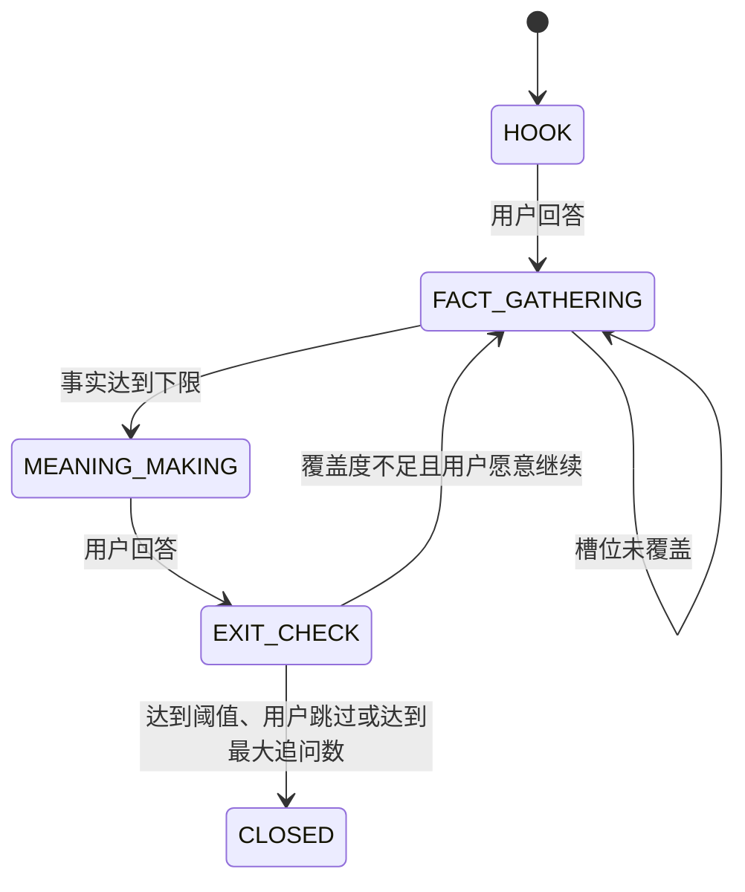

# 动态传记访谈落地方案

## 1. 结论与范围

现有项目已经有 `FastAPI + Redis + LangGraph + Vue` 的访谈闭环，并且 `InterviewParentGraph`、`InterviewStageSubgraph` 已经具备阶段进度、跨阶段线索和 Redis checkpoint。首版不应推倒重来：保留开场、卡片引导、会话状态机与前端聊天页；把固定的 `S1-S7` 访谈阶段改造成数据驱动的「传记 -> 章节 -> 采集点 -> 事件线程」模型。

一个需要先校正的产品口径：10 个章节 * 每章 3 个采集点 * 每点 2,000 字，成稿约为 60,000 字，不是 100,000 字。若 100,000 字是硬目标，应选定其一：每点目标约 3,300 字；每章 5 个采集点；或将「2,000 字」定义为单次素材小结而非最终正文长度。本方案默认以 60,000 字首版为目标，并在后台显示估算字数，避免向用户作出不一致承诺。

## 2. 目标状态

### 2.1 用户流程

1. 用户以文字讲述「最自豪或最难忘的一件事」。
2. LLM 从这段语料生成一版 8-12 章、每章 2-4 个采集点的**草稿大纲**，并标出已知人物、地点、时间和不确定项。
3. 家属/受访者在管理台预览并编辑大纲、排序、禁问话题和关键细节；点击发布后，系统冻结一个 `outline_version` 供本轮访谈使用。
4. 系统在一个采集点内按「引入 -> 事实补全 -> 意义建构 -> 收口」工作。每轮只问一个问题，允许跳过、改讲和暂停。
5. 用户提到一个完整但跨章节的事件时，系统压栈当前采集点，以该**事件**为临时线程追问；收集完成后归档素材并回到压栈前的位置，绝不跳过该章节的其余内容。
6. 完成的素材可以随时供大纲修订或未来章节调用；最终成稿由已发布大纲和已确认素材生成。

### 2.2 边界

- 模型只输出结构化建议；状态变更、跳过、入栈、出栈和归档均由后端规则执行。
- 「信息熵足够」不作为不可解释的黑盒条件。首版使用可审计的覆盖度评分，并允许模型给出建议但不能单独结束采集点。
- 情绪、拒答和安全分流优先于采集进度。沿用现有“先路由、再生成”的提示词结构；用户明确说不聊时不追问。

## 3. 与当前工程的映射

| 当前实现 | 保留 | 调整 |
| --- | --- | --- |
| `InterviewStateMachine` | 开场、引导卡、暂停/恢复入口 | 增加 biography、outline version 和 active thread 指针 |
| `InterviewParentGraph` | LangGraph 编排、checkpoint | 不再按 `S1-S7` 静态编译子图；改为单个通用采集点子图，运行时从数据库加载采集点 |
| `InterviewStageSubgraph` | 主问题、追问、收口的局部图能力 | 改名/重构为 `CollectionPointSubgraph`，状态使用 `collection_point_id` 与 `thread_id` |
| `interview_stage_config.py` | 作为默认大纲模板 | 不再是真实用户流程的唯一来源；新用户可由此模板加高光语料生成草稿 |
| Redis 与 `RedisCheckpointSaver` | 短期会话、LangGraph 断点、低延迟状态 | PostgreSQL 成为大纲、素材、审计与可恢复栈的事实存储；Redis 可失效重建 |
| Vue 聊天页 | 现有文字会话 | 增加跳过、回到主线和“本段已记录”轻提示；新增家属管理台 |

当前 `cross_stage_current` 的行为是“记录线索后回到原阶段”，不能满足方案中的“先把发散事件讲完整再恢复”。它应替换为下文的 `thread_stack`，不能继续把跨阶段内容直接当作阶段跳转。

## 4. 领域模型与存储

新增 PostgreSQL（建议 SQLAlchemy async + Alembic），Redis 继续仅保存会话热状态。核心表如下：

| 表 | 核心字段 | 说明 |
| --- | --- | --- |
| `biographies` | `id, interviewee_id, status, active_outline_version_id` | 一部传记的聚合根 |
| `outline_versions` | `id, biography_id, version, status(draft/published/archived), source_highlight` | 草稿可修改，发布后不可原地改写 |
| `chapters` | `id, outline_version_id, ordinal, title, life_stage, key_details, status` | 约 8-12 章 |
| `collection_points` | `id, chapter_id, ordinal, title, hook, target_slots, exit_threshold, status` | 每章 2-4 个微任务 |
| `interview_sessions` | `id, biography_id, active_thread_id, active_point_id, state, last_turn_at` | 长期会话锚点 |
| `conversation_turns` | `id, session_id, thread_id, role, content, router_result, created_at` | 对话原文及路由审计 |
| `story_threads` | `id, session_id, point_id, parent_thread_id, kind(primary/diversion), status, resume_snapshot` | 主线及临时事件线程；`parent_thread_id` 形成栈 |
| `material_fragments` | `id, biography_id, source_thread_id, chapter_id, point_id, content, facts, tags, confidence, review_status` | 静默归档的最小素材单元，可在未来章节复用 |
| `thread_evaluations` | `thread_id, coverage, missing_slots, meaning_ready, exit_reason, model_version` | 收口依据和模型审计 |
| `audit_events` | `aggregate_type, aggregate_id, event_type, payload, actor, created_at` | 大纲编辑、状态迁移、跳过、恢复均留痕 |

`resume_snapshot` 至少保存：`collection_point_id`、当前四步阶段、已覆盖槽位、待问问题、追问次数、局部摘要、上下文消息游标与入栈原因。事务内同时写入 `story_threads`、`conversation_turns` 和 `audit_events`，再刷新 Redis；不能只把栈放在 Redis。

## 5. 关键工作流

### 5.1 高光破冰与动态大纲

高光回答提交后异步执行三个任务：

1. `extract_highlight`：抽取人物、地点、时间、事件、情绪、价值观和待确认事实。
2. `generate_outline`：以默认模板、抽取结果和已知禁忌为输入，产出严格 JSON 的章节、采集点、每点 Hook、目标槽位和关键细节建议。
3. `validate_outline`：代码校验章节数、采集点数、重复度、禁问命中、顺序、字数预算和 schema。失败时自动修复一次，仍失败则保存为待人工处理草稿。

大纲草稿生成不得阻塞聊天接口。前端先确认“已记下这段故事”，随后轮询或 SSE 接收 `outline_ready`。发布大纲前必须有编辑确认；在访谈中修改大纲应创建新版本，并把未完成采集点映射到新版本，已完成素材保留原版本关联。

### 5.2 采集点四步工作流

通用 `CollectionPointSubgraph` 以 `thread_id` 为 checkpoint key，按以下状态运行：



目标槽位统一为 `when, where, people, trigger, action, outcome, sensory_detail, feeling, meaning`；不同采集点可设置必填子集。`FACT_GATHERING` 每轮只从缺失槽位中选一个自然问题，`MEANING_MAKING` 只在关键事实已具备后触发。

首版退出分数建议为：必填 5W1H 完整度 60%、可核实细节 15%、情感/感官 10%、意义反思 15%。达到 `0.75` 且已进入意义建构，或用户主动跳过/继续主线，才能关闭；最多 8 次有效追问，防止无限追问。评价结果必须写入 `thread_evaluations`，由代码判断是否 `CLOSED`。

### 5.3 统一语义路由与中断恢复

每条用户消息先调用低温、短上下文的路由器，严格返回：

```json
{
  "intent": "continue | cross_topic_event | explicit_navigation | skip | free_talk | safety",
  "target_chapter_id": "optional UUID",
  "target_point_id": "optional UUID",
  "event_scope": "none | bounded_event | broad_life_stage",
  "confidence": 0.0,
  "emotion_route": "normal_interview | mild_emotional_guidance | strong_emotional_guidance | resistance_turn | implicit_low_engagement",
  "round_decrement": 0,
  "reason": "short text"
}
```

后端判定规则：只有 `intent=cross_topic_event`、`event_scope=bounded_event`、置信度不低于 `0.80` 且不命中情绪/拒答优先级时，才允许 `PUSH`。仅提到未来阶段、泛泛谈“工作那些年”，或置信度不足时，作为 `material_fragment` 线索归档，然后继续当前采集点。

`PUSH` 在事务内挂起主线程快照，创建 `kind=diversion` 的子线程和一个临时采集点（仅描述该事件，不复制整个目标章节）。子线程仍执行四步工作流。关闭后，提取为 `material_fragment` 并标注其目标章节/采集点；系统生成一句过渡话术，`POP` 恢复父线程的原 `collection_point_id` 与待问问题。只有用户明确要求“我们先讲工作”时，才执行 `explicit_navigation` 并在 UI 中显示切换确认。

## 6. API 与界面

保持现有 `/interview/dialog/*` 兼容，新增版本化 API：

| API | 用途 |
| --- | --- |
| `POST /api/v1/biographies` | 建传记和受访者 |
| `POST /api/v1/biographies/{id}/icebreaker` | 提交文字高光并创建大纲任务 |
| `GET/PATCH /api/v1/biographies/{id}/outline-draft` | 读取、编辑、排序章节和 Key Details |
| `POST /api/v1/biographies/{id}/outline-versions/{version}/publish` | 校验并发布大纲 |
| `POST /api/v1/interview/sessions` | 基于已发布版本启动或恢复会话 |
| `POST /api/v1/interview/sessions/{id}/turns` | 提交转写文本，返回话术、线程状态和进度 |
| `POST /api/v1/interview/sessions/{id}/commands` | `skip`, `resume_primary`, `navigate`, `pause` |
| `GET /api/v1/biographies/{id}/materials` | 管理台审核、修正和查看素材归档 |

首版仅处理文字聊天，直接调用 `/turns`。管理台至少提供大纲树编辑、关键细节编辑、禁问设置、素材待确认列表、当前线程/恢复点和审计时间线；不要把模型内部置信度、提示词或路由理由直接展示给受访者。

## 7. 实施顺序

1. **基础设施与模型**：在 `compose.yaml` 增加 PostgreSQL，新增迁移、Repository 和上述聚合表；为现有 Redis 会话增加 `biography_id`，不破坏现有文本访谈。
2. **动态大纲**：实现高光抽取、JSON schema 校验、草稿/发布版本和管理 API；将 `S1-S7` 转换为首版模板数据。
3. **数据驱动访谈**：将静态 `InterviewStageSubgraph` 收敛为参数化 `CollectionPointSubgraph`，并以 `thread_id` 保存 checkpoint。先完成 Hook、事实槽位和手动跳过。
4. **评估与归档**：接入素材抽取、覆盖度评分、意义建构和自动收口；失败时保持当前线程，绝不自动丢弃素材。
5. **中断恢复**：实现路由 schema、`PUSH/POP` 事务、临时事件线程与平滑回归；移除“跨阶段直接跳转”的默认行为。
6. **家属管理台**：实现大纲编辑、关键细节、素材审核与线程恢复点；最后迁移前端进度展示为章节/采集点而非 `S1-S7`。

## 8. 验收、可观测性与测试

- 大纲生成：每次输出通过 schema 与禁问校验；编辑发布后，已发布版本不可被覆盖。
- 采集点：提供 5W1H 的事件能进入意义问题并完成；拒答、跳过和低参与均在一轮内降低压力或结束当前点。
- 中断恢复：在“童年”讲到一件工作事件后，子线程关闭后 active point 必须仍是原童年采集点；目标工作章节只新增素材，进度不自动前移。
- 恢复：清空 Redis 后可根据 PostgreSQL 恢复到最后确认的线程与快照；重复提交同一 `turn_id` 不产生重复素材或重复入栈。
- 审计：每次路由、状态转换、版本发布、跳过、入栈和出栈都有 `correlation_id`、模型版本、耗时和结果。
- 指标：大纲编辑率、采集点完成率、平均有效追问数、自动收口后用户继续补充率、中断恢复成功率、拒答后二次追问率（目标为 0）、路由与模型失败率。

首版测试应覆盖单元测试（schema、评分、栈规则）、API 集成测试（事务与幂等）、LangGraph checkpoint 恢复测试，以及 20-30 条人工标注的跨话题/拒答/情绪回归样本。现有 `tests/test_interview_flow_rules.py` 可以保留为兼容用例，动态模型应新增独立测试文件而不是继续往固定阶段规则中堆分支。
