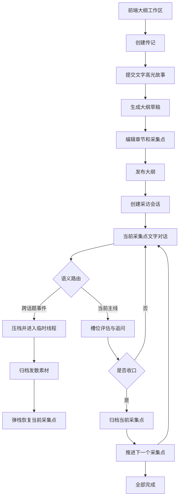

# 当前核心采访流程与代码阅读指南

本文只描述当前落地的核心流程：**文字高光故事 -> 大纲生成与编辑 -> 发布 -> 采集点访谈 -> 中断/恢复 -> 素材归档**。

当前不包含语音能力。Redis 用于会话状态，PostgreSQL 用于大纲和素材持久化。

## 补充：高光现在是多轮对话

当前高光不再由用户一次性输入后直接生成大纲。实际链路是：

```text
startHighlight()
  -> POST /api/v1/biographies/{biography_id}/highlight-sessions
  -> HighlightInterviewService.start()
  -> 多轮 sendHighlight()
  -> POST /api/v1/biographies/{biography_id}/highlight-sessions/{session_id}/messages
  -> HighlightInterviewService.handle()
  -> 槽位评估与追问
  -> 用户主动收口或覆盖度达标
  -> OutlineService.create_draft()
```

高光对话状态暂存在 Redis，包含消息、轮次、已覆盖槽位和评估结果；只有 `ready=true` 后，前端才显示可编辑的大纲。

## 一、先看整体链路



## 二、用户实际操作流程

### 1. 进入大纲工作区

前端入口是 `frontend/src/App.vue`。当前默认页是 `outline`，因此用户先看到大纲工作区，而不是旧的阶段聊天页。

### 2. 输入高光故事并生成草稿

用户在 `OutlineConsole.vue` 输入至少 10 个字符的文字故事，点击生成：

```text
useOutlineConsole.generate()
  -> createBiography()
  -> createOutlineDraft()
  -> POST /api/v1/biographies
  -> POST /api/v1/biographies/{biography_id}/highlight-sessions
  -> POST /api/v1/biographies/{biography_id}/highlight-sessions/{session_id}/messages
```

后端入口：

- `app/api/v1/routes/biography.py`
- `app/services/outline_service.py`
- `app/services/biography_store.py`

`HighlightInterviewService` 先在 Redis 保存多轮高光对话和槽位评估；收口后才调用 `OutlineService.create_draft()`。模型配置缺失、调用失败或返回格式不合法时直接报错，不生成替代内容。

### 3. 编辑并发布大纲

用户可以在前端修改章节标题、采集点标题和 Hook：

```text
OutlineConsole.save()
  -> PUT /api/v1/outlines/{outline_id}

OutlineConsole.publish()
  -> POST /api/v1/outlines/{outline_id}/publish
```

发布后，`BiographyStore.replace_draft()` 会拒绝修改，保证采访期间大纲稳定。

### 4. 创建采访会话

点击“开始采访”后：

```text
startOutlineInterview()
  -> dialog.startPublishedOutline()
  -> POST /api/v1/interview/sessions
  -> InterviewStateMachine.start_outline_session()
```

`start_outline_session()` 会：

1. 校验大纲属于当前传记。
2. 校验大纲状态为 `published`。
3. 找到第一个采集点。
4. 在 Redis 写入 `biography_id`、`outline_id`、`active_point_id`、`active_point`。
5. 返回第一个采集点的 Hook。

### 5. 进行一个采集点的文字访谈

前端发送文字：

```text
MessageComposer
  -> useInterviewDialog.sendText()
  -> POST /api/v1/interview/dialog/text
  -> InterviewStateMachine.handle_dialog_text()
```

当 Redis 进度里存在 `outline_id` 和 `active_point` 时，入口会转到：

```text
_handle_outline_turn()
```

该方法是当前核心采访逻辑，按以下顺序执行：

1. 读取当前采集点。
2. 使用 `UnifiedSemanticRouter.classify_outline()` 判断是否跨话题。
3. 主线内容追加到 `point_messages`。
4. `CollectionPointEvaluator.extract_slots()` 提取槽位。
5. `CollectionPointEvaluator.evaluate()` 计算覆盖度和缺失槽位。
6. 未收集完整时，根据第一个缺失槽位生成下一句追问。
7. 达到覆盖阈值、用户主动结束或满足最低覆盖度的最大轮次时收口。
8. 归档素材并调用 `BiographyStore.next_point()` 推进下一点。

主要槽位：

```text
when / where / people / trigger / action / outcome
sensory_detail / feeling / meaning
```

### 6. 跨话题中断与恢复

例如当前聊童年，用户突然讲到“第一份工作”：

```text
_handle_outline_turn()
  -> UnifiedSemanticRouter.classify_outline()
  -> _start_diversion()
  -> ThreadStack.push()
  -> 临时线程追问
  -> _continue_diversion()
  -> BiographyStore.archive_material()
  -> ThreadStack.pop()
  -> 恢复原采集点的 point_snapshot
```

`ThreadStack` 保存的核心状态包括：

- 原采集点 ID
- 原采集点消息
- 已覆盖槽位
- 当前轮次
- 当前评估结果

发散素材的 `target_stage_id` 会写入 PostgreSQL，主线不会因此跳到整个目标章节。

### 7. 采集点完成与结束

有两种收口方式：

- 自动收口：信息覆盖度达到条件。
- 手动收口：调用 `POST /api/v1/interview/sessions/{session_id}/commands`，命令为 `complete_point`。

当前点归档后，按大纲顺序进入下一个点；最后一个点完成后，状态进入 `end`。

## 三、按这个顺序阅读代码

### 第 1 层：先读 API 路由

1. `app/api/v1/router.py`
2. `app/api/v1/routes/biography.py`
3. `app/api/v1/routes/interview_dialog.py`
4. `app/schemas/biography.py`
5. `app/schemas/interview.py`

目标：先记住请求如何进入服务层，以及每个 API 的请求/响应结构。

### 第 2 层：读大纲和数据库边界

1. `app/services/outline_service.py`
2. `app/services/biography_store.py`
3. `app/core/config.py`
4. `compose.yaml`

重点关注：

- `create_draft()` 如何调用 LLM，以及模型错误如何向上抛出。
- `replace_draft()` 为什么只允许 draft。
- `publish_outline()` 如何保证至少存在一个采集点。
- PostgreSQL 四张表的关联关系。

### 第 3 层：读状态机主入口

文件：`app/services/interview_state_machine.py`

按以下方法顺序阅读：

1. `start_outline_session()`：会话初始化。
2. `handle_dialog_text()`：文字请求总入口。
3. `_handle_outline_turn()`：当前主流程。
4. `_start_diversion()`：中断压栈。
5. `_continue_diversion()`：临时线程和恢复。
6. `handle_thread_command()`：手动完成采集点。
7. `_initial_interview_progress()`、`_set_interview_progress()`、`_thread_progress_fields()`：Redis 状态结构。

阅读时优先忽略文件中旧的 LangGraph S1-S7 兼容代码；当前正式入口是存在 `outline_id` 时的动态采集点分支。

### 第 4 层：读三个纯逻辑模块

1. `app/services/semantic_router.py`
   - 判断拒答、跳过、普通回答和跨话题。
   - `classify_outline()` 优先匹配生成式大纲的采集点标题。
2. `app/services/collection_point_evaluator.py`
   - 槽位提取、覆盖度计算、收口条件。
3. `app/services/thread_stack.py`
   - `push()` 保存主线。
   - `pop()` 恢复主线。

这三个模块不依赖 Web 框架，适合单独阅读和测试。

### 第 5 层：最后读前端状态串联

1. `frontend/src/App.vue`
2. `frontend/src/components/OutlineConsole.vue`
3. `frontend/src/composables/useOutlineConsole.js`
4. `frontend/src/composables/useInterviewDialog.js`
5. `frontend/src/api/interview.js`

前端只做三件事：收集输入、调用 API、展示后端状态；采集点推进和中断恢复均以后端状态为准。

## 四、关键状态和数据位置

### Redis：会话状态

重点字段：

```json
{
  "biography_id": "...",
  "outline_id": "...",
  "active_point_id": "...",
  "active_point": {},
  "point_messages": [],
  "point_slots": [],
  "point_turns": 0,
  "point_evaluation": {},
  "thread_stack": [],
  "diversion": null
}
```

### PostgreSQL：业务持久化

```text
biographies             传记主体
outline_versions        大纲版本和发布状态
collection_points       章节下的采集点
material_fragments      主线或发散素材归档
```

### 不要把两者混淆

- Redis 丢失：会话进度可能丢失，但已归档的大纲/素材仍在 PostgreSQL。
- PostgreSQL 不可用：不能创建大纲、发布大纲或归档素材。
- 两者都正常：才能完整恢复采访。

## 五、调试和验证入口

启动依赖：

```powershell
docker compose -p interview-agent up -d postgres redis
```

检查服务：

```powershell
Invoke-RestMethod http://127.0.0.1:8000/api/v1/health
docker compose -p interview-agent exec -T postgres pg_isready -U interview -d interview
docker compose -p interview-agent exec -T redis redis-cli ping
```

运行核心测试：

```powershell
.\.venv\Scripts\python.exe -m pytest -q tests/test_biography_flow.py tests/test_collection_point_evaluator.py tests/test_semantic_router.py tests/test_thread_stack.py
```

优先调试顺序：

1. 先查 API 请求是否命中正确路由。
2. 再查 Redis 中 `outline_id` 和 `active_point` 是否存在。
3. 再查 `point_evaluation` 是否正确更新。
4. 最后查 PostgreSQL 的 `material_fragments` 是否生成记录。

## 六、核心文件速查表

| 目的 | 文件 |
| --- | --- |
| 大纲 API | `app/api/v1/routes/biography.py` |
| 采访 API | `app/api/v1/routes/interview_dialog.py` |
| 采访状态机 | `app/services/interview_state_machine.py` |
| 大纲生成 | `app/services/outline_service.py` |
| PostgreSQL 存储 | `app/services/biography_store.py` |
| ORM 模型和连接 | `app/db/models.py`、`app/db/session.py` |
| 语义路由 | `app/services/semantic_router.py` |
| 槽位评估 | `app/services/collection_point_evaluator.py` |
| 中断恢复 | `app/services/thread_stack.py` |
| 大纲前端 | `frontend/src/components/OutlineConsole.vue` |
| 前端 API 状态 | `frontend/src/composables/useOutlineConsole.js`、`useInterviewDialog.js` |
