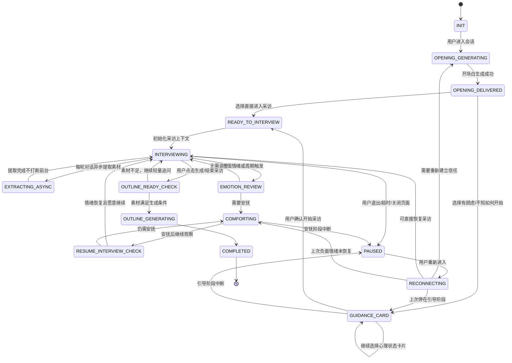
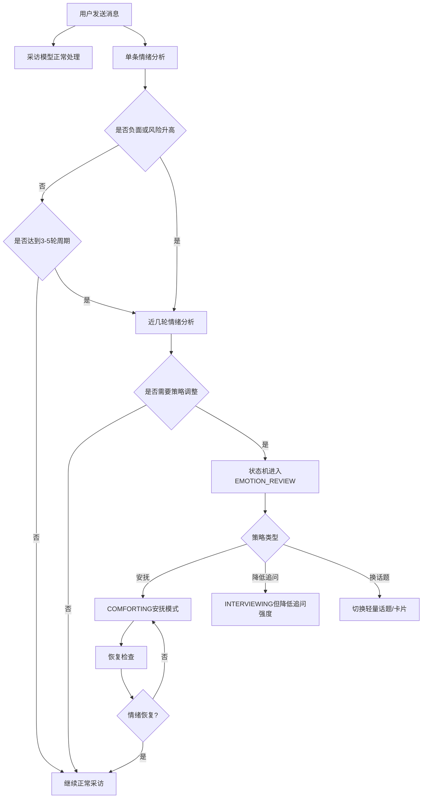

# 银发传记产品任务落地方案

## 1. 文档任务范围说明

本方案依据《银发传记产品设计文档（合并版）》全文设计，但只对原文中明确标注“任务”的内容生成方案。未标注“任务”的内容不单独展开为独立方案，仅作为系统约束、数据流约束和后续实现衔接依据。

本次覆盖的任务包括：

1. 流程监控状态机设计：支持流程中断重连，保证流程可控，并提供清晰简洁的流转图。
2. 引导用户开始讲述过往经历：
   - 任务1：开场白定制、提示词模板、结构化输出设计。
   - 任务2：根据不同卡片语料设计语料库和提示词模板，引导用户开启采访。
   - 任务3：设计该模块 demo 实现。
3. 情绪分析：
   - 任务1：设计单条情感分析结构化输出和近几条情绪分析结构化输出。
   - 任务2：设计情绪分析实现方案，并提供两套提示词。
   - 任务3：设计安抚用户语料库。

## 2. 全局业务目标与设计原则

### 2.1 核心目标

系统要在低认知负担、高安全感的对话环境中，引导银发用户讲述过往经历，并把对话内容沉淀为可用于后续传记生成的大纲素材。

系统需要兼顾以下能力：

- 引导用户开始讲述过往经历。
- 使用采访语气进行自然对话。
- 检测用户情绪，并调整会话策略。
- 整理并存储用户输入，为后续事件结构化、传记大纲生成和用户画像沉淀服务。
- 支持用户中断、退出、重连、补充和召回。

### 2.2 企业落地原则

1. 状态驱动：用户生命周期、引导流程、采访流程、安抚流程、中断恢复都由状态机控制，避免业务逻辑散落在前端或模型提示词中。
2. 模型输出结构化：LLM 只负责理解、生成和判断，不直接决定系统最终动作；系统根据结构化字段和规则引擎执行。
3. 双通道上下文：对话上下文服务于采访体验，结构化素材服务于传记大纲生成，两者分开存储和治理。
4. 情绪安全优先：负面情绪出现时，降低追问强度；涉及隐私、痛苦、回避时优先安抚和尊重边界。
5. 可恢复、可追踪、可审计：每次状态变化、情绪判断、策略调整、开场生成都需要记录原因和版本，便于运营复盘和模型优化。

## 3. 任务一：流程监控状态机设计

### 3.1 状态机定位

状态机用于控制用户从进入系统、完成开场引导、进入采访、情绪异常处理、中断退出、重连恢复、素材沉淀到大纲生成的完整生命周期。

状态机不替代采访模型，而是作为上层流程控制器：

- 决定当前应该调用哪个能力：开场白生成、卡片引导、采访模型、情绪分析、安抚语料、信息提取、补充提醒。
- 记录当前用户进度：首次进入、引导中、采访中、安抚中、中断、恢复、生成大纲。
- 支持中断重连：用户退出后重新进入，可以根据上一次状态、事件进度、情绪状态和缺失信息恢复到合适位置。

### 3.2 核心状态定义

| 状态编码 | 状态名称 | 说明 | 主要动作 | 可持久化位置 |
|---|---|---|---|---|
| INIT | 初始化 | 用户进入会话，系统加载用户画像、历史会话、未完成事件 | 拉取用户上下文、判断是否首次进入 | Redis + PostgreSQL |
| OPENING_GENERATING | 开场白生成中 | 根据用户历史、场景、状态生成定制开场白 | 调用开场白 LLM 模板 | Redis |
| OPENING_DELIVERED | 开场白已送达 | 开场白展示完成，等待用户选择 | 展示“直接进入采访 / 我有顾虑”卡片 | Redis |
| GUIDANCE_CARD | 引导卡片处理中 | 用户选择顾虑、状态或帮助卡片 | 调用卡片引导语料和模板 | Redis |
| READY_TO_INTERVIEW | 准备进入采访 | 用户已确认开始采访 | 初始化采访上下文 | Redis |
| INTERVIEWING | 正常采访中 | 采访模型进行提问和回答 | 调用采访模型、异步信息提取、单句情绪分析 | Redis + PostgreSQL |
| EMOTION_REVIEW | 情绪策略分析中 | 负面情绪触发或周期性触发近几轮分析 | 调用近几轮情绪分析模板 | Redis |
| COMFORTING | 安抚中 | 用户出现焦虑、烦躁、防御、冷漠等状态 | 调用安抚语料和降压策略 | Redis |
| RESUME_INTERVIEW_CHECK | 回到采访检查 | 判断用户是否恢复到可继续采访状态 | 分析近几轮情绪和用户意愿 | Redis |
| PAUSED | 会话暂停 | 用户关闭页面、无输入超时或主动退出 | 保存进度、记录断点 | Redis + PostgreSQL |
| RECONNECTING | 中断重连 | 用户重新进入系统 | 根据断点生成恢复话术和卡片 | Redis |
| EXTRACTING_ASYNC | 异步信息提取中 | 后台提取事件要素、完整度、缺口 | LLM 抽取 + 规则比对 | Redis + PostgreSQL JSONB |
| OUTLINE_READY_CHECK | 大纲生成检查 | 用户点击生成或满足生成条件 | 检查素材完整度 | PostgreSQL |
| OUTLINE_GENERATING | 大纲生成中 | 生成传记核心大纲 | 调用大纲生成链路 | PostgreSQL |
| COMPLETED | 本轮完成 | 本轮采访或大纲生成完成 | 保存总结、画像、事件素材 | PostgreSQL |

### 3.3 状态流转图



### 3.4 中断重连规则

| 中断前状态 | 重连后建议状态 | 恢复策略 |
|---|---|---|
| OPENING_DELIVERED | OPENING_GENERATING | 生成“欢迎回来”的简短开场，不重复首次用户话术 |
| GUIDANCE_CARD | GUIDANCE_CARD | 展示上次未完成的心理状态卡片，并补一句“我们可以慢慢来” |
| INTERVIEWING | INTERVIEWING | 用最近事件摘要恢复：“上次你讲到……要不要从这里继续？” |
| COMFORTING | COMFORTING 或 GUIDANCE_CARD | 不直接追问事实，先确认用户是否愿意继续 |
| PAUSED 且缺失关键事件要素 | RECONNECTING | 用卡片提示是否补充时间、地点、人物等缺口 |
| OUTLINE_GENERATING | OUTLINE_GENERATING | 前端展示生成中，后端通过任务 ID 查询进度 |

### 3.5 状态持久化数据结构

```json
{
  "session_id": "sess_20260609_001",
  "user_id": "user_001",
  "current_state": "INTERVIEWING",
  "previous_state": "READY_TO_INTERVIEW",
  "interview_stage": "life_event_collection",
  "active_story_id": "story_001",
  "last_event_tag": "参军时期",
  "emotion_snapshot": {
    "dominant_emotion": "engagement",
    "risk_level": "low",
    "updated_at": "2026-06-09T10:30:00+08:00"
  },
  "resume_policy": {
    "can_resume_directly": true,
    "resume_message_type": "continue_last_story",
    "need_card": false
  },
  "updated_at": "2026-06-09T10:30:00+08:00"
}
```

### 3.6 企业实现建议

- Redis 保存实时状态：`session:{session_id}:state`，TTL 可按业务设置为 7-30 天。
- PostgreSQL 保存长期状态快照：用于审计、断点恢复、运营分析。
- 状态流转必须由后端服务统一执行，前端只提交用户事件，如 `CARD_SELECTED`、`USER_MESSAGE_SENT`、`USER_EXITED`。
- 每次流转记录 `from_state`、`to_state`、`trigger_event`、`reason`、`operator`、`model_version`。
- LLM 输出不能直接改状态，必须经过规则层校验。例如模型判断用户焦虑，系统还要结合置信度、敏感词、用户历史偏好决定是否进入 `COMFORTING`。

## 4. 任务二：引导用户开始讲述过往经历

## 4.1 任务2.1：开场白定制方案

### 4.1.1 设计目标

开场白要在 30 秒内降低用户认知负担，建立信任，并引导用户完成第一个低门槛动作。它不应该像问卷开头，也不应该让用户立刻面对“讲讲你的一生”这类过大的问题。

开场白必须满足：

- 身份锚定：说明系统是无评判、有安全感的传记记录助手。
- 价值映射：用简短语言说明用户经历值得被记录。
- 微行动召唤：第一问尽量是简单事实问题，如出生地、小时候住在哪里、最早记得的家。
- 动态调整：首次用户、重连用户、长期用户使用不同话术。
- 结构化输出：方便前端展示、卡片生成、埋点和 A/B 测试。

### 4.1.2 开场白输入变量

```json
{
  "user_profile": {
    "nickname": "张阿姨",
    "age_range": "60-75",
    "known_life_stage": ["童年", "工作", "家庭"],
    "communication_preference": "温和、慢节奏",
    "avoid_topics": ["疾病细节"]
  },
  "session_context": {
    "is_first_visit": false,
    "last_state": "INTERVIEWING",
    "last_story_summary": "上次讲到年轻时第一次离开家去外地工作",
    "unfinished_slots": ["地点", "关键人物"],
    "last_emotion": "engagement",
    "days_since_last_visit": 3
  },
  "business_context": {
    "product_role": "传记记录助手",
    "tone": "温和、尊重、像采访者",
    "max_opening_sentences": 3
  }
}
```

### 4.1.3 开场白结构化输出

```json
{
  "opening_type": "resume_user",
  "main_message": "张阿姨，欢迎回来。上次您讲到第一次离家去外地工作，那段经历很值得慢慢记下来。",
  "trust_sentence": "这里没有标准答案，您想到哪里，我们就从哪里开始。",
  "micro_question": "您还记得那次离家时，是从哪个地方出发的吗？",
  "suggested_cards": [
    {
      "card_id": "start_interview",
      "label": "继续讲这个故事",
      "next_action": "ENTER_INTERVIEW"
    },
    {
      "card_id": "need_guidance",
      "label": "我还没想好怎么说",
      "next_action": "SHOW_GUIDANCE_CARD"
    }
  ],
  "risk_notes": {
    "avoid_topics": ["疾病细节"],
    "do_not_ask": ["过于隐私的问题", "需要长篇总结的问题"]
  },
  "telemetry_tags": ["opening", "resume", "low_cognitive_load"]
}
```

### 4.1.4 开场白提示词模板

```text
你是一个面向银发用户的传记记录助手，目标是帮助用户自然、安心地讲述人生经历。

请根据输入信息生成一个开场白。要求：
1. 语气温和、尊重、像真人采访者，不要像客服、问卷或命令式系统。
2. 首次用户要建立信任；重连用户要承接上次内容；长期用户要避免重复介绍。
3. 开场白总句数不超过 3 句。
4. 必须包含一个低门槛问题，优先问事实类问题，如时间、地点、人物、当时场景。
5. 不要要求用户一次性讲完整个人生。
6. 不要触碰 avoid_topics 中的敏感话题。
7. 输出必须是合法 JSON，不要输出 Markdown。

输入：
用户画像：{{user_profile}}
会话上下文：{{session_context}}
业务上下文：{{business_context}}

请按以下 JSON Schema 输出：
{
  "opening_type": "first_user | resume_user | long_term_user | sensitive_return",
  "main_message": "主开场语",
  "trust_sentence": "建立安全感的话",
  "micro_question": "低门槛启动问题",
  "suggested_cards": [
    {
      "card_id": "start_interview | need_guidance",
      "label": "卡片文案",
      "next_action": "ENTER_INTERVIEW | SHOW_GUIDANCE_CARD"
    }
  ],
  "risk_notes": {
    "avoid_topics": [],
    "do_not_ask": []
  },
  "telemetry_tags": []
}
```

### 4.1.5 不同用户场景示例

| 场景 | 开场策略 | 示例 |
|---|---|---|
| 首次进入 | 建立身份和安全感 | “您好，我会像一位安静的记录者，陪您把重要经历慢慢整理下来。这里没有标准答案，我们先从一个简单的问题开始：您小时候主要住在哪里？” |
| 中途回来 | 承接上次故事 | “欢迎回来。上次您讲到年轻时第一次离开家，那段经历很有画面感。我们可以接着从那天出发前的情景聊起。” |
| 长期用户 | 减少重复介绍 | “今天我们继续慢慢记。您上次提到工作后的一个转折，要不要从那位影响您的人说起？” |
| 情绪谨慎用户 | 降低压力 | “我们不用急着讲完整，只记录您愿意留下的部分就好。可以先从一个轻松的问题开始：那时候您身边常出现的人是谁？” |

## 4.2 任务2.2：卡片语料与引导提示词设计

### 4.2.1 卡片交互流程

1. 用户进入后展示开场白。
2. 开场白完成后展示两个主卡片：
   - 直接进入采访
   - 我有顾虑，不知道该如何开启采访
3. 用户选择“我有顾虑”后，展示心理状态卡片。
4. 系统根据卡片选择生成安抚和引导话术。
5. 引导后再次展示“开始采访 / 继续看看怎么聊”选项，直到用户进入采访或退出。

### 4.2.2 心理状态卡片语料库

| 卡片 ID | 用户选择 | 用户心理判断 | 系统回应目标 | 基础语料 |
|---|---|---|---|---|
| relaxed_slow | 放松自在，想慢慢回忆故事 | 接受度高，节奏偏慢 | 给予陪伴感，直接进入低压采访 | “那我们就慢慢来，不急着讲完整。您想到哪里，我就帮您记到哪里。” |
| emotional_memory | 有点感慨，愿意聊聊过往 | 情绪被触动，可能需要温柔承接 | 先共情，再引导 | “有些回忆一想起来确实会有很多感受。您可以只讲愿意讲的部分，我会帮您好好记录。” |
| unknown_process | 采访是以什么方式进行的，我不了解 | 对流程不确定 | 解释流程，降低未知感 | “方式很简单，我会像聊天一样问几个小问题，您不用准备，也不用一次讲完整。” |
| restrained | 略带拘谨，不太习惯表达 | 表达压力、自我效能低 | 降低表达要求 | “没关系，讲得零散也可以。您说几个词、几句话，我也能帮您慢慢整理成故事。” |
| enthusiastic | 兴致满满，很乐意分享 | 高参与度 | 快速进入采访 | “太好了，那我们可以直接开始。先从您最想被家人记住的一段经历说起，或者从小时候说起都可以。” |
| scattered | 思绪杂乱，不知从何说起 | 需要结构引导 | 提供可选入口 | “我们可以不用按顺序来。您可以从一个人、一个地方，或一件现在还记得的小事开始。” |

### 4.2.3 卡片引导结构化输出

```json
{
  "selected_card_id": "scattered",
  "response_strategy": "provide_structure",
  "assistant_message": "我们可以不用按顺序来。您可以从一个人、一个地方，或一件现在还记得的小事开始。",
  "next_question": "您现在脑子里最先浮现的是一个人、一个地方，还是一件事？",
  "next_cards": [
    {
      "card_id": "start_with_person",
      "label": "从一个人开始",
      "next_action": "GUIDE_BY_PERSON"
    },
    {
      "card_id": "start_with_place",
      "label": "从一个地方开始",
      "next_action": "GUIDE_BY_PLACE"
    },
    {
      "card_id": "start_with_event",
      "label": "从一件事开始",
      "next_action": "GUIDE_BY_EVENT"
    }
  ],
  "can_enter_interview": true,
  "recommended_next_state": "GUIDANCE_CARD"
}
```

### 4.2.4 卡片引导提示词模板

```text
你是银发传记产品的引导助手。用户刚刚选择了一个心理状态卡片。

你的目标：
1. 先回应用户当前心理，不评价、不纠正、不催促。
2. 用一句话降低用户表达压力。
3. 给出一个非常容易回答的下一步问题。
4. 如果用户适合进入采访，提供“开始采访”选项。
5. 如果用户仍然顾虑，提供更细的入口卡片。
6. 输出必须是合法 JSON。

输入：
用户选择卡片：{{selected_card}}
用户画像：{{user_profile}}
最近会话状态：{{session_context}}
可用卡片配置：{{card_config}}

输出 JSON Schema：
{
  "selected_card_id": "string",
  "response_strategy": "comfort | explain_process | provide_structure | quick_start | slow_start",
  "assistant_message": "对用户的安抚或解释",
  "next_question": "低门槛下一问",
  "next_cards": [
    {
      "card_id": "string",
      "label": "string",
      "next_action": "string"
    }
  ],
  "can_enter_interview": true,
  "recommended_next_state": "GUIDANCE_CARD | READY_TO_INTERVIEW"
}
```

### 4.2.5 卡片与状态机衔接

| 用户动作 | 后端事件 | 状态变化 | 调用能力 |
|---|---|---|---|
| 点击“直接进入采访” | CARD_SELECTED_START | OPENING_DELIVERED -> READY_TO_INTERVIEW | 初始化采访上下文 |
| 点击“我有顾虑” | CARD_SELECTED_GUIDANCE | OPENING_DELIVERED -> GUIDANCE_CARD | 卡片引导模板 |
| 选择心理状态卡片 | PSYCHOLOGY_CARD_SELECTED | GUIDANCE_CARD -> GUIDANCE_CARD | 卡片语料 + LLM 改写 |
| 点击“开始采访” | CARD_SELECTED_START | GUIDANCE_CARD -> READY_TO_INTERVIEW | 采访模型 |
| 用户退出 | USER_EXITED | 任意状态 -> PAUSED | 保存断点 |

## 4.3 任务2.3：引导模块 demo 实现设计

### 4.3.1 demo 目标

demo 用于验证引导流程是否能顺利把用户从进入系统带到采访阶段，并验证以下能力：

- 首次进入与重连进入使用不同开场白。
- 用户选择不同心理状态卡片后，系统生成不同引导话术。
- 用户可以循环停留在引导阶段，也可以随时进入采访。
- 状态机可记录和恢复当前流程。
- 输出结构可直接对接前端卡片组件。

### 4.3.2 推荐技术架构

| 层级 | demo 技术选型 | 企业生产建议 |
|---|---|---|
| 前端 | Vue/React + 卡片组件 | 与正式 App/小程序集成 |
| API | FastAPI / NestJS | 按团队技术栈选择 |
| 状态缓存 | Redis | Redis Cluster |
| 长期存储 | PostgreSQL | PostgreSQL + JSONB + 审计表 |
| LLM 调用 | 模型网关封装 | 统一 prompt version、trace_id、fallback |
| 日志 | 本地日志 | ELK / OpenTelemetry |

### 4.3.3 API 设计

#### 创建或恢复会话

```http
POST /api/interview/session/start
```

请求：

```json
{
  "user_id": "user_001",
  "entry_source": "app_home",
  "device_id": "device_001"
}
```

响应：

```json
{
  "session_id": "sess_001",
  "state": "OPENING_DELIVERED",
  "message": {
    "main_message": "张阿姨，欢迎回来。上次您讲到第一次离家去外地工作，那段经历很值得慢慢记下来。",
    "trust_sentence": "这里没有标准答案，您想到哪里，我们就从哪里开始。",
    "micro_question": "您还记得那次离家时，是从哪个地方出发的吗？"
  },
  "cards": [
    {"card_id": "start_interview", "label": "继续讲这个故事"},
    {"card_id": "need_guidance", "label": "我还没想好怎么说"}
  ]
}
```

#### 提交卡片选择

```http
POST /api/interview/session/{session_id}/card
```

请求：

```json
{
  "card_id": "scattered",
  "client_ts": "2026-06-09T10:31:00+08:00"
}
```

响应：

```json
{
  "state": "GUIDANCE_CARD",
  "assistant_message": "我们可以不用按顺序来。您可以从一个人、一个地方，或一件现在还记得的小事开始。",
  "next_question": "您现在脑子里最先浮现的是一个人、一个地方，还是一件事？",
  "cards": [
    {"card_id": "start_with_person", "label": "从一个人开始"},
    {"card_id": "start_with_place", "label": "从一个地方开始"},
    {"card_id": "start_with_event", "label": "从一件事开始"},
    {"card_id": "start_interview", "label": "开始采访"}
  ]
}
```

### 4.3.4 demo 伪代码

```python
class GuidanceService:
    def start_session(self, user_id: str) -> dict:
        profile = profile_repo.get_user_profile(user_id)
        last_session = session_repo.get_last_session(user_id)
        state = state_machine.init(user_id, last_session)

        opening_input = build_opening_input(profile, last_session, state)
        opening = llm_gateway.generate_json(
            prompt_version="opening_v1",
            payload=opening_input
        )

        state_machine.transition(
            session_id=state.session_id,
            event="OPENING_GENERATED",
            to_state="OPENING_DELIVERED",
            reason="opening generated successfully"
        )

        return {
            "session_id": state.session_id,
            "state": "OPENING_DELIVERED",
            "message": opening,
            "cards": opening["suggested_cards"]
        }

    def handle_card(self, session_id: str, card_id: str) -> dict:
        current_state = state_repo.get(session_id)

        if card_id in ["start_interview", "continue_story"]:
            state_machine.transition(session_id, "CARD_SELECTED_START", "READY_TO_INTERVIEW")
            return interview_service.prepare(session_id)

        selected_card = card_config.get(card_id)
        guidance = llm_gateway.generate_json(
            prompt_version="guidance_card_v1",
            payload={
                "selected_card": selected_card,
                "session_context": state_repo.get_context(session_id),
                "user_profile": profile_repo.get_by_session(session_id)
            }
        )

        state_machine.transition(session_id, "PSYCHOLOGY_CARD_SELECTED", guidance["recommended_next_state"])
        return guidance
```

### 4.3.5 demo 验收标准

| 验收项 | 标准 |
|---|---|
| 首次用户开场 | 不超过 3 句，包含身份锚定、安全感和低门槛问题 |
| 重连用户开场 | 能承接上次故事，不重复首次介绍 |
| 卡片引导 | 六类心理状态均有不同回应策略 |
| 状态记录 | 每次卡片点击都产生状态流转日志 |
| 可进入采访 | 用户点击开始后状态进入 READY_TO_INTERVIEW 或 INTERVIEWING |
| 可恢复 | 中断后重新进入能根据断点生成恢复话术 |

## 5. 任务三：情绪分析

## 5.1 任务3.1：情绪分析结构化输出设计

### 5.1.1 情绪分类建议

结合文档目标，情绪类别建议精简为可执行的策略类别，而不是过多心理学标签。

| 情绪编码 | 中文名称 | 典型表现 | 系统策略 |
|---|---|---|---|
| joy | 愉悦 | 乐意分享、表达积极 | 保持节奏，可适度深入 |
| engagement | 专注 | 认真叙述事实、信息密度高 | 正常采访，补充关键要素 |
| nostalgia | 怀念 | 感慨、回忆过去、有情绪色彩 | 温柔承接，避免打断 |
| anxiety | 焦虑/警惕 | 担心隐私、不知道怎么说 | 解释边界，降低要求 |
| frustration | 烦躁/沮丧 | 嫌问题多、觉得麻烦 | 减少追问，承认打扰 |
| apathy | 敷衍/冷漠 | 回复短、动力低 | 换入口、降低任务感 |
| defensive | 防御/抵抗 | 拒绝回答、强调不想说 | 尊重边界，禁止继续追问该点 |
| sadness | 悲伤 | 痛苦回忆、哽咽、失落 | 安抚优先，允许暂停 |

### 5.1.2 单条情感分析结构化输出

单条分析用于每轮用户输入后的快速判断，要求延迟低、字段少、可直接用于实时策略。

```json
{
  "message_id": "msg_001",
  "session_id": "sess_001",
  "primary_emotion": "nostalgia",
  "secondary_emotions": ["sadness"],
  "valence": -0.2,
  "arousal": 0.45,
  "confidence": 0.78,
  "risk_level": "medium",
  "engagement_level": "medium",
  "boundary_signal": {
    "has_privacy_concern": false,
    "has_refusal": false,
    "sensitive_topic": false,
    "do_not_probe": []
  },
  "conversation_signal": {
    "input_intent": "continue_story",
    "answer_quality": "has_story_detail",
    "should_slow_down": true,
    "should_ask_follow_up": true
  },
  "recommended_action": {
    "action_type": "soft_follow_up",
    "reason": "用户有怀念和轻微悲伤，但仍愿意继续讲述",
    "allowed_question_type": ["感受承接", "轻量事实补充"],
    "forbidden_question_type": ["连续追问", "隐私深挖"]
  },
  "storage_ttl_minutes": 180
}
```

字段说明：

| 字段 | 作用 |
|---|---|
| primary_emotion | 当前主要情绪，用于策略分支 |
| valence | 情绪正负向，范围 -1 到 1 |
| arousal | 情绪激活程度，范围 0 到 1 |
| risk_level | 是否需要进入安抚或人工兜底 |
| boundary_signal | 是否触及隐私、拒绝、敏感话题 |
| recommended_action | 供会话主控选择下一步策略 |

### 5.1.3 近几条情绪分析结构化输出

近几条分析用于策略调整，不必每轮调用；负面情绪触发时立即调用，无负面情绪时每 3-5 轮调用一次。

```json
{
  "session_id": "sess_001",
  "window": {
    "message_count": 5,
    "time_range_minutes": 4,
    "start_message_id": "msg_010",
    "end_message_id": "msg_014"
  },
  "emotion_trend": {
    "trend_type": "declining",
    "from_emotion": "engagement",
    "to_emotion": "frustration",
    "evidence": [
      "用户回复变短",
      "出现'一直问这个干什么'",
      "输入间隔变长"
    ]
  },
  "root_cause_analysis": {
    "likely_causes": [
      {
        "cause": "系统连续追问同一事件缺失信息",
        "confidence": 0.82
      }
    ],
    "trigger_question_ids": ["q_017", "q_018"],
    "sensitive_slots": ["地点", "人物关系"]
  },
  "user_state_summary": {
    "willingness_to_continue": "low",
    "preferred_pace": "slow",
    "current_need": "被理解和减少压力"
  },
  "strategy_adjustment": {
    "next_mode": "COMFORTING",
    "duration_suggestion_turns": 2,
    "tone": "道歉、理解、降压",
    "question_policy": {
      "can_ask_question": false,
      "allowed_after_recovery": ["是否愿意换个轻松的话题"],
      "blocked_slots": ["地点", "人物关系"]
    },
    "resume_condition": {
      "required_emotions": ["engagement", "nostalgia", "joy"],
      "minimum_turns": 2,
      "user_explicit_continue": true
    }
  },
  "memory_update": {
    "profile_tags_to_add": ["不喜欢连续追问细节"],
    "avoid_future_strategy": ["连续追问地点和人物关系"],
    "redis_write_required": true,
    "postgres_profile_update_required": true
  }
}
```

### 5.1.4 Redis 存储建议

单条情绪结果：

```text
Key: session:{session_id}:emotion:list
Type: LIST
Value: emotion_json
TTL: 180 minutes
```

近几轮策略报告：

```text
Key: session:{session_id}:strategy_report:list
Type: LIST
Value: strategy_report_json
TTL: 7 days
```

用户画像沉淀：

```text
PostgreSQL table: user_interaction_preference
字段：user_id, preference_tag, evidence, confidence, source_session_id, created_at
```

## 5.2 任务3.2：情绪分析实现方案与提示词

### 5.2.1 总体流程



### 5.2.2 单句情绪分析提示词

```text
你是银发传记采访系统中的情绪遥测分析器。你只负责分析用户最新一条输入的情绪和对话信号，不负责生成回复。

业务背景：
系统正在帮助银发用户讲述人生经历，目标是让用户感到安全、被尊重、无压力，并逐步沉淀传记素材。

请根据以下信息分析用户最新输入：
- 用户最新输入：{{user_message}}
- 最近一轮助手问题：{{last_assistant_message}}
- 输入耗时秒数：{{input_latency_seconds}}
- 用户输入字数：{{input_length}}
- 最近情绪摘要：{{recent_emotion_summary}}
- 用户画像偏好：{{user_profile_preferences}}

分析要求：
1. 不要过度诊断，不输出医学或心理疾病判断。
2. 重点判断是否影响下一轮采访策略。
3. 如果用户拒绝、回避、担心隐私，必须标记 boundary_signal。
4. 如果用户只是沉浸回忆但带有感慨，不要简单判为负面。
5. 输出必须是合法 JSON，不要输出解释文字。

输出 JSON Schema：
{
  "message_id": "{{message_id}}",
  "session_id": "{{session_id}}",
  "primary_emotion": "joy | engagement | nostalgia | anxiety | frustration | apathy | defensive | sadness",
  "secondary_emotions": [],
  "valence": 0.0,
  "arousal": 0.0,
  "confidence": 0.0,
  "risk_level": "low | medium | high",
  "engagement_level": "low | medium | high",
  "boundary_signal": {
    "has_privacy_concern": false,
    "has_refusal": false,
    "sensitive_topic": false,
    "do_not_probe": []
  },
  "conversation_signal": {
    "input_intent": "continue_story | ask_help | refuse | change_topic | unclear",
    "answer_quality": "no_answer | short_answer | has_fact | has_story_detail | emotional_expression",
    "should_slow_down": false,
    "should_ask_follow_up": true
  },
  "recommended_action": {
    "action_type": "normal_follow_up | soft_follow_up | comfort | explain_boundary | change_topic | pause",
    "reason": "string",
    "allowed_question_type": [],
    "forbidden_question_type": []
  },
  "storage_ttl_minutes": 180
}
```

### 5.2.3 近几轮情绪分析提示词

```text
你是银发传记采访系统中的会话策略分析器。你需要根据近几轮对话和单句情绪结果，判断用户情绪变化原因，并给出下一步会话策略。

业务背景：
系统需要在用户愿意讲述时保持采访节奏，在用户焦虑、烦躁、防御、悲伤或敷衍时及时降低压力。系统后续还会基于用户输入生成事件结构和传记大纲，因此策略既要保护用户体验，也要保证素材采集可持续。

输入：
近几轮对话：{{recent_dialogues}}
近几轮单句情绪分析：{{recent_emotion_items}}
当前事件结构化缺口：{{current_story_missing_slots}}
用户画像偏好：{{user_profile_preferences}}
当前状态机状态：{{current_state}}

分析要求：
1. 判断情绪趋势，而不是只看单条消息。
2. 找出可能导致情绪变化的系统行为，例如连续追问、问题过大、触及隐私、节奏太快。
3. 如果用户情绪下降，优先保护体验，不要强行补全事件槽位。
4. 给出明确的 next_mode，供状态机执行。
5. 说明恢复正常采访的条件。
6. 输出必须是合法 JSON。

输出 JSON Schema：
{
  "session_id": "{{session_id}}",
  "window": {
    "message_count": 0,
    "time_range_minutes": 0,
    "start_message_id": "string",
    "end_message_id": "string"
  },
  "emotion_trend": {
    "trend_type": "stable_positive | stable_neutral | improving | declining | volatile",
    "from_emotion": "string",
    "to_emotion": "string",
    "evidence": []
  },
  "root_cause_analysis": {
    "likely_causes": [
      {
        "cause": "string",
        "confidence": 0.0
      }
    ],
    "trigger_question_ids": [],
    "sensitive_slots": []
  },
  "user_state_summary": {
    "willingness_to_continue": "low | medium | high",
    "preferred_pace": "slow | normal | fast",
    "current_need": "string"
  },
  "strategy_adjustment": {
    "next_mode": "INTERVIEWING | COMFORTING | GUIDANCE_CARD | PAUSED",
    "duration_suggestion_turns": 0,
    "tone": "string",
    "question_policy": {
      "can_ask_question": true,
      "allowed_after_recovery": [],
      "blocked_slots": []
    },
    "resume_condition": {
      "required_emotions": [],
      "minimum_turns": 0,
      "user_explicit_continue": false
    }
  },
  "memory_update": {
    "profile_tags_to_add": [],
    "avoid_future_strategy": [],
    "redis_write_required": true,
    "postgres_profile_update_required": false
  }
}
```

### 5.2.4 策略执行规则

| 情绪/趋势 | 状态机动作 | 采访策略 |
|---|---|---|
| joy / engagement 稳定 | 保持 INTERVIEWING | 正常追问时间、地点、人物、事件、结果 |
| nostalgia 稳定 | 保持 INTERVIEWING | 先共情，再轻问一个事实或感受 |
| anxiety 中等以上 | 进入 EMOTION_REVIEW，可能 COMFORTING | 解释“可以不回答”，减少隐私问题 |
| frustration | 进入 COMFORTING | 道歉、承认问题多、暂停追问 |
| apathy | GUIDANCE_CARD 或轻量换题 | 使用卡片给用户选择权 |
| defensive | COMFORTING 或 PAUSED | 尊重边界，把相关槽位标记为不追问 |
| sadness 高风险 | COMFORTING | 不追问细节，允许暂停，必要时人工提示 |

### 5.2.5 安抚模式退出条件

系统不能因为说了一句安抚话就立刻恢复采访，必须满足以下条件之一：

- 用户明确表达愿意继续，例如“没事，继续说吧”。
- 连续 2 轮单句情绪分析显示 `risk_level=low` 且 `engagement_level>=medium`。
- 近几轮分析给出 `next_mode=INTERVIEWING`。

如果用户仍然焦虑、防御或拒绝，系统继续保持 `COMFORTING` 或进入 `PAUSED`，并保存断点。

## 5.3 任务3.3：安抚用户语料库设计

### 5.3.1 语料库设计原则

- 不说教，不评判，不纠正用户。
- 不使用“您不要难过”“您想开点”这类无效安慰。
- 不在负面情绪中继续补全事件槽位。
- 明确给用户选择权：可以跳过、暂停、换个话题、只讲一点点。
- 语气与银发用户匹配：温和、克制、有陪伴感。

### 5.3.2 安抚语料库

| 情绪 | 场景 | 安抚话术 | 后续动作 |
|---|---|---|---|
| anxiety | 用户不知道怎么讲 | “不用一下子讲清楚，想到几个词也可以。我会帮您慢慢整理。” | 提供“从人/地方/事情开始”卡片 |
| anxiety | 用户担心隐私 | “您不愿意说的部分可以跳过，我只记录您愿意留下的内容。” | 标记隐私边界，避免追问 |
| frustration | 用户嫌问题多 | “刚才我问得有点细了，我们先不追这些细节。” | 暂停事实追问 |
| frustration | 用户觉得麻烦 | “我们可以简单一点，您随便说几句就好，不需要说完整。” | 降低问题难度 |
| apathy | 用户回复很短 | “今天也可以只记一点点，不一定要聊很久。” | 换轻量入口 |
| defensive | 用户拒绝回答 | “好的，这个我们不聊。您愿意的话，可以换一段更轻松的回忆。” | 将该槽位加入 blocked_slots |
| sadness | 用户讲到伤心事 | “这段回忆听起来对您很重要，也可能不容易讲。我们可以慢一点，或者先停一停。” | 不追问细节 |
| nostalgia | 用户感慨过去 | “这些细节很珍贵，慢慢说就好。我会尽量帮您把那种感觉留下来。” | 轻量追问画面或人物 |
| scattered | 用户思绪乱 | “没关系，回忆本来就不一定按顺序来。我们可以先抓住一个最清楚的画面。” | 提供结构化入口 |
| unknown_process | 用户不了解采访 | “方式很简单，我问一点，您答一点；答不出来也没关系，我们可以换个问法。” | 解释流程并展示开始卡片 |

### 5.3.3 安抚话术生成模板

```text
你是银发传记采访系统中的安抚话术生成器。

目标：
根据用户当前情绪和上下文，生成一段温和、尊重、低压力的话术，帮助用户恢复安全感。

要求：
1. 不要继续追问敏感事实。
2. 不要否定用户感受。
3. 不要使用夸张鸡汤。
4. 最多 2 句。
5. 可以提供选择权：跳过、暂停、换话题、只讲一点。
6. 输出 JSON。

输入：
当前情绪：{{primary_emotion}}
近几轮情绪趋势：{{emotion_trend}}
触发原因：{{root_cause}}
禁止追问槽位：{{blocked_slots}}
当前事件摘要：{{story_summary}}

输出：
{
  "comfort_message": "string",
  "next_user_options": [
    {
      "option_id": "pause | change_topic | continue_lightly | start_with_card",
      "label": "string"
    }
  ],
  "question_allowed": false,
  "blocked_slots": [],
  "recommended_next_state": "COMFORTING | GUIDANCE_CARD | INTERVIEWING | PAUSED"
}
```

### 5.3.4 安抚语料企业治理

企业落地时，安抚语料库建议配置化管理：

| 字段 | 说明 |
|---|---|
| corpus_id | 语料 ID |
| emotion | 适用情绪 |
| scenario | 适用场景 |
| template | 语料模板 |
| forbidden_context | 不适用场景 |
| priority | 命中优先级 |
| version | 版本号 |
| approved_by | 审核人 |
| enabled | 是否启用 |

建议后台提供运营配置能力，允许业务人员调整语料，但上线前必须经过敏感词、隐私、医疗化表达和年龄歧视表达检查。

## 6. 与全文后续实现的衔接

### 6.1 与采访模型衔接

文档中已有训练好的采访对话模型，因此本方案不替代采访模型，而是在采访模型外层增加流程主控：

```text
用户输入
  -> 状态机判断当前状态
  -> 情绪分析并更新策略
  -> 若正常采访，调用采访模型
  -> 若情绪异常，调用安抚语料或引导卡片
  -> 异步信息提取，更新事件结构
```

### 6.2 与信息提取和大纲生成衔接

引导模块和情绪模块的输出要为后续结构化和大纲生成提供可用信号：

| 输出 | 后续用途 |
|---|---|
| active_story_id | 将用户输入归入对应事件 |
| last_event_tag | 支持事件切换和 Redis 标签 |
| emotion_snapshot | 影响采访语气和用户画像 |
| blocked_slots | 后续不再追问用户回避内容 |
| unfinished_slots | 用户重连和召回时生成轻量补充问题 |
| opening_type | 分析不同开场策略的转化效果 |

### 6.3 与 Redis / PostgreSQL JSONB 衔接

实时链路：

- Redis Hash：保存会话状态、当前事件 ID、当前阶段。
- Redis List：保存近几轮情绪结果、策略分析报告、对话摘要。
- Redis 标签：标记当前用户正在讲述的事件，如 `story:参军时期`。


---

## 7. 扩展方案：从"采访"到"传记"的闭环策略

### 7.1 扩展总览

当前项目已完成采访对话 + 情绪分析的 demo 闭环。但要真正交付"传记产品"，还需要以下模块：

| 序号 | 扩展模块 | 核心目标 | 依赖已有能力 |
|---|---|---|---|
| 7.2 | Redis 数据结构全景 | 统一规范所有 Redis Key 设计 | session_store / 状态机 context |
| 7.3 | 故事素材提取器 | 每轮对话自动抽取事件、人物、时间、地点 | 情绪分析 / 采访对话 |
| 7.4 | 对话摘要与长期记忆 | 超过 12 轮后不怕上下文窗口溢出 | 采访对话 / Redis |
| 7.5 | 情绪驱动的自适应策略 | 状态机真正根据情绪结果调整流程 | 情绪分析 / 状态机 |
| 7.6 | 传记大纲生成 | 采访结束后自动生成章节大纲 | 素材提取 / Redis JSONB |
| 7.7 | 多轮引导卡片扩展 | 树形卡片结构 + 智能推荐 | 引导卡片 / 用户画像 |
| 7.8 | 隐私与数据合规 | 敏感字段加密 + 一键删除 + 审计日志 | Redis / PostgreSQL |


---

## 7.2 Redis 数据结构全景设计

### 7.2.1 设计原则

1. **热数据在 Redis，冷数据在 PostgreSQL**：采访中频繁读写的状态、情绪、对话轮次用 Redis；历史归档、用户画像、传记产出用 PostgreSQL JSONB。
2. **Key 按业务域分层**：`session`、`emotion`、`story`、`strategy`、`profile` 各有独立前缀，不会互相污染。
3. **TTL 分级管理**：情绪数据短 TTL（3小时），对话历史中 TTL（7天），状态机长 TTL（30天）。
4. **List 存时序，Hash 存快照，Set 存索引**：不同读写模式用不同 Redis 类型。

### 7.2.2 完整 Redis Key 设计

#### A. 状态机层

```
session:{session_id}:state
Type:  Hash
写入方: InterviewStateMachine._save_context()
读取方: InterviewStateMachine._get_context()
TTL:   30 天

字段：
  current_state        → "INTERVIEWING"           # 当前状态
  previous_state       → "READY_TO_INTERVIEW"      # 上一个状态
  guidance_round       → "2"                       # 已完成的引导轮数
  max_guidance_rounds  → "3"                       # 最多允许的引导轮数
  active_story_id      → "story_uuid_001"           # 当前正在采集的事件 ID
  last_event_tag       → "参军时期"                 # 最近一个事件的标签
  created_at           → "2026-06-10T08:00:00Z"
  updated_at           → "2026-06-10T08:15:00Z"

---
session:{session_id}:dialog
Type:  List
写入方: InterviewStateMachine.handle_dialog_text()
读取方: InterviewAgentService._generate_interview_reply()
TTL:   7 天

内容：每轮对话一条 JSON（轮次号在 value 里）
  [0] → {"turn":1,"role":"user","content":"我小时候住在乡下，家里有六口人..."}
  [1] → {"turn":1,"role":"assistant","content":"六口人一起生活，那时候热闹吗？您还记得..."
  [2] → {"turn":2,"role":"user","content":"很热闹，我父亲那时候在镇上教书..."
  ...

读取规则：LLEN 获取长度，LRANGE -12 -1 取最近 12 轮（每次调用截断）
```

#### B. 情绪分析层

```
session:{session_id}:emotion:current
Type:  String (JSON)
写入方: EmotionService.analyze()
读取方: 状态机 handle_dialog_text() / 前端展示
TTL:   3 小时

内容：最新一次单句情绪分析结果
  {
    "message_id": "msg_a1b2c3d4",
    "primary_emotion": "engagement",
    "valence": 0.65,
    "confidence": 0.82,
    "risk_level": "low",
    "boundary_signal": { "has_refusal": false, ... },
    "recommended_action": { "action_type": "normal_follow_up", ... }
  }

设计理由：String 而非 Hash，因为情绪分析结果是嵌套 JSON，Hash 不适合深层嵌套。
TTL 短是因为情绪只影响当轮策略，不需要长期保留。

---
session:{session_id}:emotion:history
Type:  List
写入方: EmotionService.analyze() 每次追加
读取方: 近几轮情绪分析触发时
TTL:   7 天

内容：按时间顺序排列的单句情绪结果
  [0] → {"turn":1, "primary_emotion":"engagement", ...}
  [1] → {"turn":2, "primary_emotion":"nostalgia", ...}
  [2] → {"turn":3, "primary_emotion":"frustration", ...}

读取规则：LRANGE -5 -1 取最近 5 条，拼接成近几轮分析的输入 prompt。
```

#### C. 策略分析层

```
session:{session_id}:strategy:report
Type:  String (JSON)
写入方: 近几轮情绪分析（StrategyAnalyzer）
读取方: 状态机判断下一步动作
TTL:   7 天

内容：最近一次策略分析报告
  {
    "generated_at": "2026-06-10T08:16:00Z",
    "emotion_trend": {
      "trend_type": "declining",
      "from_emotion": "engagement",
      "to_emotion": "frustration"
    },
    "strategy_adjustment": {
      "next_mode": "COMFORTING",
      "duration_suggestion_turns": 2,
      "blocked_slots": ["地点细节"]
    },
    "resume_condition": {
      "required_emotions": ["engagement", "nostalgia"],
      "minimum_turns": 2
    }
  }

---
session:{session_id}:strategy:history
Type:  List (最多保留 10 条)
写入方: 策略分析产出时追加
读取方: 运营分析 / 趋势看板
TTL:   7 天
```

#### D. 故事素材层

```
session:{session_id}:story:{story_id}
Type:  Hash
写入方: StoryExtractor（异步素材提取服务）
读取方: 大纲生成 / 用户查看素材
TTL:   30 天

字段：
  story_id      → "story_uuid_001"
  event_label   → "参军时期"
  start_turn    → "3"                          # 从第几轮开始讲这个事件
  end_turn      → "8"                          # 到第几轮结束
  collected_at  → "2026-06-10T08:20:00Z"
  event_json    → '{"title":"参军","year":"1965",...}'   # 结构化事件
  raw_dialogue  → '["turn3_user","turn3_ai",...]'       # 原始对话引用

---
session:{session_id}:story:index
Type:  List
写入方: StoryExtractor 每提取到一个新事件就 RPUSH
读取方: 大纲生成时遍历
TTL:   30 天

内容：该 session 下所有 story_id 的索引
  [0] → "story_uuid_001"
  [1] → "story_uuid_002"
  [2] → "story_uuid_003"
```

#### E. 用户画像快照层

```
user:{user_id}:profile:snapshot
Type:  Hash
写入方: 策略分析产出的 memory_update
读取方: 开场白生成 / 采访策略
TTL:   永久（由 PostgreSQL 主导，Redis 做热缓存）

字段：
  communication_preference → "温和、慢节奏"
  avoid_topics             → '["疾病细节","家庭矛盾"]'
  blocked_question_types   → '["连续追问地点细节"]'
  known_life_stages        → '["童年","参军","工作","家庭"]'
  last_emotion_summary     → "engagement"
  last_visit_at            → "2026-06-09T10:00:00Z"
  visit_count              → "5"
```

### 7.2.3 Redis Key 速查表

| Key 模式 | 类型 | TTL | 用途 |
|---|---|---|---|
| `session:{id}:state` | Hash | 30d | 状态机上下文 |
| `session:{id}:dialog` | List | 7d | 对话历史 |
| `session:{id}:emotion:current` | String | 3h | 最新情绪 |
| `session:{id}:emotion:history` | List | 7d | 情绪时序 |
| `session:{id}:strategy:report` | String | 7d | 策略报告 |
| `session:{id}:strategy:history` | List | 7d | 策略历史 |
| `session:{id}:story:{story_id}` | Hash | 30d | 单条事件素材 |
| `session:{id}:story:index` | List | 30d | 事件 ID 索引 |
| `user:{id}:profile:snapshot` | Hash | 永久 | 用户画像缓存 |


---

## 7.3 故事素材提取器

### 7.3.1 策略

- **触发时机**：每轮 `handle_dialog_text()` 结束后，异步触发（不阻塞前端响应）
- **提取粒度**：每轮都可能产出 0-1 个 `StoryFragment`
- **去重逻辑**：如果当前轮内容仍属于 `active_story_id`，则追加碎片；如果判断进入了新事件，则创建新 `story_id`
- **判定新事件**：由 LLM 单次最大 200 token 判断即可（极轻量 prompt）

### 7.3.2 产出结构

```python
class StoryFragment(BaseModel):
    story_id: str         # 归属的事件 ID
    event_label: str      # 事件标签，如"参军时期"
    year: str | None      # "1965" 或 "1965年左右"
    location: str | None  # "河北保定"
    people: list[str]     # ["父亲","班长"]
    action: str           # 一句话摘要："第一次离开家坐上去军营的火车"
    emotion_tags: list[str]  # ["nostalgia","pride"]
    keywords: list[str]   # ["军营","火车","离别"]
    raw_turn_ids: list[int]  # 引用哪些对话轮次
```

### 7.3.3 与对话流的衔接

```
handle_dialog_text() 
  → 1. emotion_service.analyze()              # 同步：情绪分析
  → 2. interview_agent.generate_turn()        # 同步：采访回复
  → 3. 返回前端                                # 不等待 4
  → 4. story_extractor.extract()  [异步]       # 后台：素材提取 → 写入 Redis Hash
```


---

## 7.4 对话摘要与长期记忆

### 7.4.1 问题

当前 `_trim_messages` 只取最近 12 轮原文，超过就丢弃。但用户可能在第 15 轮突然提到"我刚说的那个班长"，LLM 需要知道前面内容。

### 7.4.2 策略：滚动摘要窗口

```
每 6 轮（即每完成 3 个问答来回）：
  → 将前 6 轮原文输入 LLM，生成 150 字摘要
  → 摘要存入 Redis Hash: session:{id}:summary:round_{n}
  → 对话历史 List 不做精简（保留审计）

采访 LLM 生成问题时：
  → 传入最近 12 轮原文 + 之前所有摘要（1-3 段，约 500 字）
  → 既保持近期细节，又有远距离上下文
```

### 7.4.3 Redis 字段

```
session:{session_id}:summary:current
Type:  String
写入方: 摘要生成服务
读取方: 采访模型 prompt 构造
TTL:   30d

内容：当前全局摘要（500 字以内）
  "用户张阿姨主要讲述了：1) 童年住在河北乡下，家里六口人...2) 1965年参军..."
```


---

## 7.5 情绪驱动的自适应策略

### 7.5.1 当前问题

现在情绪分析产出了 `recommended_action`，但状态机并没有真正用它来改变采访行为。它只是作为文本附加在助手消息后面供前端展示。

### 7.5.2 策略：状态机读取策略报告

在 `handle_dialog_text()` 中增加一个判断：

```
handle_dialog_text():
  1. emotion = emotion_service.analyze(...)
  2. 如果 emotion.risk_level >= "medium" 或 emotion.primary_emotion 属于负面：
     → 写 emotion 到 history list
     → 触发"近几轮分析"（取最近 5 条情绪）
     → 产出 strategy_report
     → 根据 strategy_report.next_mode 决定：
         "INTERVIEWING"    → 正常生成采访问题
         "COMFORTING"      → 调用安抚语料库，不调用采访模型
         "GUIDANCE_CARD"   → 返回引导卡片，让用户重新选择话题
         "PAUSED"          → 提示可以暂停，保存断点
  3. 如果正常 → 继续采访
```

### 7.5.3 状态机新增状态

不需要物理新增状态，只需要在 `INTERVIEWING` 状态下根据策略报告走不同分支：

| 策略报告 next_mode | 行为 |
|---|---|
| INTERVIEWING | 调用 `interview_agent.generate_turn()` |
| COMFORTING | 调用安抚语料库（预置 text，不调 LLM） |
| GUIDANCE_CARD | 返回引导卡片列表 + "我们可以换个话题慢慢聊" |
| PAUSED | 返回 "好的，我们先停一停，下次再继续。已经帮您保存好了。" |

这样做的好处：不引入新状态码，状态转换仍然在 `INTERVIEWING` 内部，前端不需要改状态处理逻辑。


---

## 7.6 传记大纲生成

### 7.6.1 触发条件

- 用户主动点击「生成传记大纲」
- 或者，系统判断已满足条件：>= 3 个 story_id 且有基本时间线

### 7.6.2 策略流程

```
1. 读 session:{id}:story:index  → 取出所有 story_id
2. 遍历 story_id，读 Hash 中的 event_label + event_json
3. 按 year 字段排序（缺年份的排到末尾，LLM 推测）
4. 构造 prompt：把每个事件的 label + 摘要 + 时间传给 LLM
5. LLM 输出：
   {
     "chapters": [
       { "order":1, "title":"童年记忆", "year_range":"1950-1964",
         "story_ids":["story_001","story_002"], "abstract":"在河北乡下...", "key_figures":["父亲","母亲"] },
       ...
     ],
     "timeline": [
       { "year":"1950", "event":"出生于河北小村庄", "story_ids":["story_001"] },
       ...
     ]
   }
6. 写入 PostgreSQL: biography:{session_id}:outline
7. 返回前端展示可编辑大纲
```

### 7.6.3 前端展示方式

前端渲染为可拖拽排序、可编辑标题的树形结构，类似 Notion 的目录大纲：

```
传记大纲 — 张阿姨

├── 1. 童年记忆（1950-1964）
│   ├── 讲述人：父亲、母亲
│   └── 素材：3 段对话
├── 2. 参军岁月（1965-1970）
│   ├── 讲述人：班长、战友
│   └── 素材：2 段对话
├── 3. 教书生涯（1971-2000）
│   └── 素材：1 段对话（还可补充）
```


---

## 7.7 多轮引导卡片树形扩展

### 7.7.1 当前卡片结构

```
入口卡片（2 张）： start_interview / need_guidance
   ↓ 选 need_guidance
引导卡片（6 张）： 6 种心理状态
   ↓ 选一张 → LLM 生成开场白 → 回到入口卡片
```

### 7.7.2 扩展为树形

```
入口卡片（2 张）
├── start_interview → 直接进入采访
└── need_guidance → 引导卡片（6 张心理状态）
    ├── relaxed_slow → 直接进入采访
    ├── emotional_memory → 直接进入采访 + 温柔提醒
    ├── unknown_process → 流程解释卡片层
    │   ├── "采访要多久" → 解释
    │   ├── "我可以停下来吗" → 解释
    │   └── "开始采访"
    ├── restrained → 降低难度卡片层
    │   ├── 从一个人开始 → 采访
    │   ├── 从一个地方开始 → 采访
    │   └── 从一件事开始 → 采访
    ├── enthusiastic → 直接进入采访
    └── scattered → 结构化入口卡片层
        ├── "最近印象最深的事"
        ├── "小时候的事"
        └── "工作后的事"
```

### 7.7.3 Redis 存放方式

```
session:{session_id}:card:tree
Type:  Hash
TTL:   30d

字段：
  current_node  → "scattered"               # 当前卡片支路
  path          → "entry→scattered"          # 从根到当前的路径
  depth         → "2"                        # 当前深度
  max_depth     → "3"                        # 最多向下 3 层
  visited       → '["need_guidance","scattered"]'  # 避免死循环
```

### 7.7.4 智能卡片推荐

在采访中如果用户出现以下信号，自动推送对应卡片：

| 信号 | 推荐卡片 | 原因 |
|---|---|---|
| 连续 2 轮回答 < 10 字 | scattered | 用户可能不知从何说起 |
| 情绪从 engagement 变 apathy | restrained | 用户可能累了 |
| 用户说"记不清了" | 结构化入口（人/地/事） | 降低回忆难度 |
| 连续 3 轮高参与度 | 不推送卡片 | 不打断好节奏 |


---

## 7.8 隐私与数据合规

### 7.8.1 策略

| 层级 | 措施 | 实现方式 |
|---|---|---|
| 传输层 | HTTPS + 敏感字段 AES-256 加密 | FastAPI 中间件 |
| 存储层 | Redis 中 `user:{id}:*` 前缀的 Key 不存明文真名，用 `user_id` 哈希 | `user:{sha256(user_id)}:profile:snapshot` |
| 对话层 | 对话历史 TTL 自动过期（7天） | Redis EXPIRE |
| 删除权 | 提供 `DELETE /api/v1/sessions/{id}` 一键删除 session 所有 Key | 按前缀 `session:{id}:*` SCAN + DEL |
| 审计层 | 状态流转记录存 PostgreSQL，保留操作日志 | 每次 `_transition()` 写 `state_audit_log` 表 |

### 7.8.2 删除一个 Session 的 Redis 操作

```
1. SCAN 0 MATCH session:{session_id}:* COUNT 100
2. 对每个匹配的 Key → DEL
3. 确认删除数量 = 预期数量
4. 如果 30 天内用户重连，提示 "此前的对话记录已过期，需要重新开始"
```

---

## 8. 当前项目现状 ↔ 扩展目标对照

| 维度 | 当前已完成 | 扩展后目标 |
|---|---|---|
| 状态机 | `INIT → OPENING → GUIDANCE → INTERVIEWING` 4 状态 + 断点持久化 | + `COMFORTING` / `PAUSED` / `OUTLINE_GENERATING` 等 15 状态 |
| 情绪分析 | 单条情绪分析 + fallback 降级 | + 近几轮趋势分析 + 策略报告 + 驱动状态切换 |
| Redis | `session:{id}:state` Hash + `dialog_messages` 内嵌 | 按 7.2 节的全景 Key 设计，分层存储状态/情绪/策略/素材/画像 |
| 采访对话 | 单轮 LLM 生成问题，12 轮滑动窗口 | + 滚动摘要长期记忆 + 情绪策略驱动追问强度 |
| 引导卡片 | 2 入口 + 6 心理状态，最多 3 轮 | 树形 3 层卡片 + 智能推荐 + 采访中途可退回 |
| 素材沉淀 | 无（对话只在 dialog_messages） | StoryExtractor 异步提取 → Redis Hash + PostgreSQL JSONB |
| 传记产出 | 无 | 大纲生成 → 可编辑章节 → 后续导出 PDF |
| 隐私合规 | 仅 Redis TTL | + 删除权 + 加密 + 审计日志 |

---

## 9. 推荐的实施优先级

| 优先级 | 模块 | 理由 |
|---|---|---|
| P0 | 7.2 Redis 数据结构全景 | 所有后续模块都需要按统一规范存取数据，先定 schema |
| P0 | 7.5 情绪驱动的自适应策略 | 情绪分析已经做了但不能影响流程，这是安全底线 |
| P1 | 7.3 故事素材提取器 | 没有素材沉淀，对话只是聊天，无法落地产出 |
| P1 | 7.4 对话摘要与长期记忆 | 采访一旦超过 12 轮就会丢上下文，上限太低 |
| P2 | 7.6 传记大纲生成 | 这是最终用户价值，但依赖 P1 的素材积累 |
| P2 | 7.7 多轮卡片树形扩展 | 提升引导体验，但不阻塞核心流程 |
| P2 | 7.8 隐私合规 | 上线前必须完成，但可以用中间件统一处理

长期链路：

- PostgreSQL JSONB：保存事件结构化结果。
- PostgreSQL 关系表：保存用户画像、状态流转日志、模型调用日志。
- 大纲生成模块：读取事件 JSONB、情绪变化和用户画像，生成传记核心大纲。

### 6.4 与停顿召回衔接

当用户停顿或退出时，状态机进入 `PAUSED`。后续召回不能只发通用短信或推送，而应结合当前事件缺口和用户情绪：

- 如果用户负面情绪未恢复，不发送追问型召回。
- 如果完整度低且情绪正常，可发送轻量补充提醒。
- 如果用户对某类问题防御，则召回文案不能触及该槽位。
- 如果用户是谨慎敏感型，降低推送频率或不推送。

## 7. 推荐落地里程碑

| 阶段 | 时间 | 目标 | 交付物 |
|---|---|---|---|
| P0 demo | 1-2 周 | 跑通开场白、卡片引导、状态流转 | demo API、前端卡片页、Redis 状态 |
| P1 情绪闭环 | 2-3 周 | 单句情绪分析、近几轮策略调整、安抚模式 | 情绪分析服务、策略报告、语料库 |
| P2 数据沉淀 | 2-4 周 | 对接事件结构化、PostgreSQL JSONB、用户画像 | 事件存储、画像表、状态审计 |
| P3 召回与大纲 | 3-5 周 | 支持停顿召回、补充卡片、大纲生成 | 召回策略、大纲生成链路 |

## 8. 关键风险与控制

| 风险 | 表现 | 控制措施 |
|---|---|---|
| LLM 输出不稳定 | JSON 不合法、字段缺失 | 模型网关做 JSON Schema 校验和重试 |
| 状态混乱 | 用户重连后重复开场或跳错阶段 | 所有状态流转由后端统一执行 |
| 过度追问 | 用户烦躁、防御 | 情绪分析阻断追问，blocked_slots 生效 |
| 安抚无效 | 用户继续负面 | 保持 COMFORTING 或 PAUSED，不强行采访 |
| 数据难用 | 对话有内容但无法生成大纲 | 异步结构化抽取与完整度评分并行 |
| 语料不合适 | 话术像客服或说教 | 语料库版本审核，线上 A/B 和人工复盘 |

## 9. 最小可行验收清单

### 9.1 状态机

- 能覆盖首次进入、引导、采访、情绪分析、安抚、中断、重连、大纲生成。
- 每次状态变化有明确触发事件。
- 重连后能根据中断前状态恢复，不重复使用首次开场。
- 负面情绪下不会继续强行追问事件槽位。

### 9.2 开场与卡片引导

- 开场白不超过 3 句。
- 每类用户场景有不同开场策略。
- 六类心理状态卡片均有语料。
- 卡片选择能驱动状态机变化。
- 用户能循环引导，也能随时进入采访。

### 9.3 情绪分析

- 单句情绪分析输出可被实时策略消费。
- 近几轮分析能输出情绪趋势、原因和策略。
- 安抚模式有进入和退出条件。
- 情绪结果能写入 Redis，并能沉淀到用户画像。

### 9.4 后续实现兼容

- 输出字段包含 `session_id`、`active_story_id`、`emotion_snapshot`、`blocked_slots` 等后续链路所需字段。
- 能与 PostgreSQL JSONB 事件结构衔接。
- 能支持停顿检测、召回提醒和大纲生成。

## 10. 结论

本方案将原文中明确标注的任务拆解为三个可落地模块：流程状态机、开场引导、情绪分析。设计重点不是单次生成漂亮话术，而是形成可控、可恢复、可审计、可持续优化的企业级对话系统。

在实现上，建议先以状态机和引导 demo 跑通用户进入采访的关键路径，再接入情绪分析与安抚语料，最后与事件结构化、用户画像、停顿召回和大纲生成打通。这样既能快速验证体验，也能保证后期产品不会因为流程、数据和模型策略割裂而难以扩展。